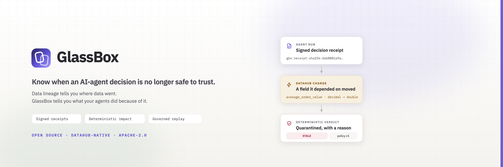
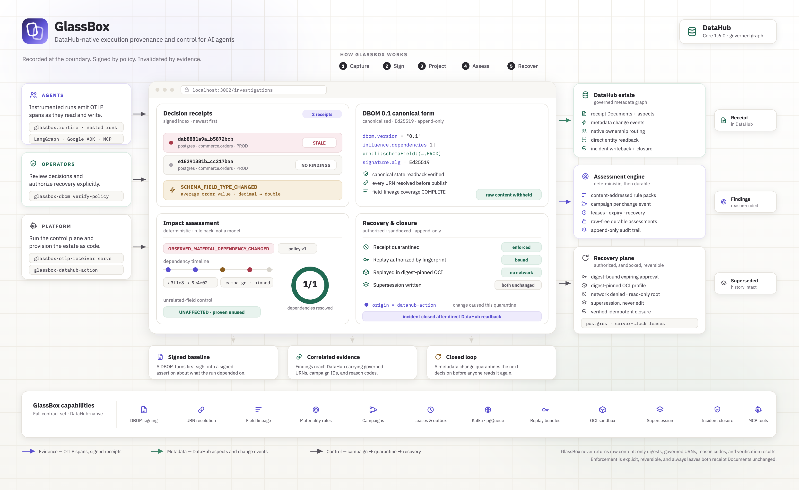

# GlassBox — Signed Decision Evidence and Deterministic Invalidation for AI Agents

> A DataHub-native execution-provenance and control layer for AI agents —
> recording a signed **Decision Bill of Materials** for consequential agent
> outputs, binding runtime evidence to **DataHub's** governed metadata graph,
> turning a metadata change into a deterministic invalidation campaign, and
> closing the loop through authorized replay and append-only supersession.

Built as an open-source **DataHub ecosystem project**, not a disposable
prototype: every capability claim traces to a committed, sanitized live evidence
report.

---

## Live

- 🌐 **Product** — https://glassboxhq.xyz
- 🎬 **Two-minute demo** — https://youtu.be/g-j9zD5cxLk
- 📖 **Documentation** — https://glassboxhq.xyz/docs
- 🗺️ **Architecture** — https://glassboxhq.xyz/docs/architecture
- 🏆 **Devpost submission** — https://devpost.com/software/glassbox-yr49mu
- 🤝 **DataHub contributions** — [Agent Forensics Skill PR #120](https://github.com/datahub-project/datahub-skills/pull/120) · [Core pgQueue proof PR #19004](https://github.com/datahub-project/datahub/pull/19004)
- 🧾 **Live evidence reports** — [`docs/compatibility/`](docs/compatibility/)

The hosted release candidate is connected to an isolated, least-privilege
DataHub Core `v1.6.0` reference estate. Its public OTLP path has admitted a real
two-span agent run, persisted the signed receipt, published five curated DataHub
Document aspects, directly read them back, and proven idempotent redelivery. The
sanitized proof is
[`datahub-1.6.0-hosted-production-otlp.live.json`](docs/compatibility/datahub-1.6.0-hosted-production-otlp.live.json).

---

## Table of Contents

- [Quick Path](#quick-path)
- [Why It Stands Out](#why-it-stands-out)
- [What it does](#what-it-does)
- [Architecture](#architecture)
- [Requirements](#requirements)
- [Setup](#setup)
- [Usage](#usage)
- [GlassBox at the decision boundary](#glassbox-at-the-decision-boundary)
  - [Instrument a run](#instrument-a-run)
  - [Install the DataHub Action](#install-the-datahub-action)
  - [Query decision evidence over MCP](#query-decision-evidence-over-mcp)
  - [Open the operator console](#open-the-operator-console)
- [Trust model](#trust-model)
- [Project layout](#project-layout)
- [License](#license)

---

## Quick Path

If you want the shortest path through the project:

```bash
uv sync --all-extras
uv run --all-extras python -m examples.flagship_demo \
  --allow-live \
  --output .glassbox/flagship/one-command-report.json
```

That single command downloads the commit-pinned official DataHub Core `v1.6.0`
quickstart, starts it on isolated ports with PostgreSQL 16, waits for health,
builds and inspects the replay sandbox, runs the real causal chain, validates
every proof boundary, writes a raw-free report, and removes only its own estate.

It is one connected chain, not a replay fixture: the exact receipt quarantined by
the live Action becomes the source of a fingerprint-authorized corrected bundle,
the corrected evidence digest replaces the affected action input, the new
decision is produced inside a source/schema-bound hardened container, and DataHub
directly reads back both receipts plus their immutable supersession relation
before the incident resolves.

For the docs site:

```bash
cd apps/console
npm install
GLASSBOX_PUBLIC_HOSTS=glassbox.localhost npm run dev
```

Then open:

- `http://glassbox.localhost:3000` for the public landing page;
- `http://glassbox.localhost:3000/docs` for the documentation;
- `http://glassbox.localhost:3000/docs/architecture` for the interactive architecture;
- `http://localhost:3000` for the disconnected operator console.

For the implementation details:

- Quickstart — [`apps/console/app/docs/quickstart`](apps/console/app/docs/quickstart/page.mdx)
- Architecture — [`apps/console/app/docs/architecture`](apps/console/app/docs/architecture/page.mdx)
- Decision records — [`docs/adr/`](docs/adr/)

## Why It Stands Out

GlassBox is strong for AI-agent governance because it does three things
together:

- **It records what a decision actually depended on.** Every consequential
  output gets a canonicalised, Ed25519-signed Decision Bill of Materials whose
  dependency set is resolved to real DataHub URNs — so a later question about
  impact is a lookup, not an investigation.
- **It decides materiality with a rule, not a model.** A metadata change becomes
  a content-addressed campaign, and a versioned, deterministic policy pack
  produces a state plus a durable reason code. The same receipt and the same
  change always produce the same verdict.
- **It closes the loop without rewriting history.** Quarantine is explicit and
  reversible. Recovery requires a digest-bound approval, executes inside a
  digest-pinned container, and lands as an append-only supersession that leaves
  both receipt Documents byte-unchanged.

The differentiator is not provenance in isolation. It is the complete chain:

```text
runtime evidence → governed projection → deterministic assessment
                 → durable quarantine → authorized recovery → verified closure
```

## What it does

- **Signed decision receipts** — canonicalises payloads with RFC 8785, digests
  with SHA-256, commits evidence sets as Merkle trees, and signs with Ed25519.
  `receipt_id` and the whole `integrity` object are excluded from digest
  material so the identity stays independently verifiable.
- **Operator-scoped signer trust** — a signature proves key possession, not
  authorization. The closed `glassbox.signer-trust.v1` policy binds every trusted
  signer to both its key ID and the SHA-256 fingerprint of its raw public key.
- **Framework-neutral runtime capture** — normalises every instrumentation mode
  into immutable `RuntimeEvent` records, correlates nested agent runs through
  explicit parent run and span IDs, and keeps raw tool arguments and results on
  the application call stack rather than on a span.
- **Strict provenance compilation** — accepts normalised events, exporter-neutral
  OpenTelemetry spans, or strict OTLP/HTTP protobuf-JSON. Pins the supported
  GenAI semantic schema URL and rejects dropped attributes, dropped events,
  duplicate span identities, and ambiguous agent-span selection instead of
  guessing.
- **Verified governed publication** — resolves every dependency to a real
  DataHub URN, then verifies the projection by direct entity readback rather than
  by write acknowledgement.
- **Durable publication obligations** — the signed receipt, its dependency index,
  and a `READY` publication row are inserted in one transaction. HTTP 200 means
  publication evidence is sealed; a 503 means retry, and the obligation survives
  the sender disappearing.
- **Deterministic invalidation** — normalises supported `MetadataChangeLogEvent_v1`
  payloads into a closed change model, evaluates a pure versioned materiality
  engine, and records raw-free assessments carrying reason codes and policy
  versions.
- **Honest completeness** — dependency resolution, field-lineage coverage, and
  wildcard queries are tracked separately, because proving a decision *was*
  affected needs one match while proving it *was not* needs the complete set.
- **Two state profiles, one protocol** — SQLite WAL for multi-process
  coordination on one host, PostgreSQL 14+ for workers across hosts, with
  row-locked claims and database-clock leases. A state transition cannot exist in
  one profile and silently not the other.
- **Independent transport proofs** — acknowledged at-least-once Kafka delivery
  and the official PostgreSQL Queue source are each proven against their own live
  estate. A success in one never marks the other proven.
- **Content-addressed replay bundles** — derived from a verified source receipt,
  independently signed, with digest-bound expiring approvals and a structurally
  non-executing dry-run renderer.
- **Isolated execution** — replay runs in one exact OCI image ID (never a mutable
  tag), with network denial, read-only root, dropped capabilities, resource
  ceilings, and a host-created content-addressed isolation attestation.
- **Domain-semantic policies** — exact equality is the default; widening it
  requires the caller to name an exact content-addressed `policy_id` *and* an
  operator registry that already trusts it.
- **Read-only forensics surface** — six proof-carrying MCP tools over the same
  PostgreSQL state authority the Action writes to, with prospective
  classifications kept visibly separate from actually persisted findings.
- **Raw-free by construction** — digests, governed URNs, reason codes, and
  verification results cross the boundary. Prompts, model outputs, tool
  arguments, field values, credentials, and signing keys never do.

## Architecture



In short: an instrumented agent run emits OTLP, and the compiler turns it into a
canonical signed receipt whose dependencies resolve to real DataHub URNs. That
receipt registers in transactional state alongside a durable publication
obligation, then publishes a governed DataHub projection verified by direct
readback. When DataHub emits a metadata change, the Action builds a
content-addressed campaign, a deterministic rule pack decides materiality, and
findings write back as incidents with optional receipt quarantine. Recovery is a
separate authorized path: a signed replay bundle, a digest-bound approval,
execution in a digest-pinned container, and an append-only supersession that
DataHub reads back before the incident closes.

**Explore it:**

- 🗺️ Interactive architecture — https://glassboxhq.xyz/docs/architecture
- 📖 Documentation — https://glassboxhq.xyz/docs
- 🧾 Live evidence reports — [`docs/compatibility/`](docs/compatibility/)
- 🧱 Decision records — [`docs/adr/`](docs/adr/)

## Requirements

- macOS or Linux
- Python 3.11–3.13 (3.12 recommended) and [`uv`](https://docs.astral.sh/uv/)
- Docker with Compose `!override` support, and enough memory for the DataHub
  quickstart profile
- Free host ports `13306`, `14319`, `15432`, `18080`, `19002`, `19092`, `19200`
  for the flagship estate — every one has a CLI override
- Optional: PostgreSQL 14+ for the multi-worker state profile

## Setup

### 1. Install

```bash
uv sync --all-extras
uv run ruff format --check .
uv run ruff check .
uv run mypy
uv run pytest
```

Install only the extras a given process needs:

```bash
uv sync --extra langchain
uv sync --extra google-adk
uv sync --extra mcp
uv sync --extra actions --extra datahub --extra postgres
```

### 2. Establish signing authority

Signature integrity and operator trust are separate concerns. `signer-entry`
derives a policy-ready public entry from an environment-indirect private key
without returning its private bytes.

```bash
uv run glassbox-dbom signer-entry
uv run glassbox-dbom verify-policy /etc/glassbox/trusted-signers.json
```

See the [signer rotation runbook](docs/operations/signing-key-rotation.md) for
enrollment, overlap, retirement, revocation, and rollback.

### 3. Initialize a state profile

SQLite coordinates processes on one host. PostgreSQL coordinates workers that
may run on different hosts; `postgres-init` is an operator-only bootstrap, after
which compilers and Action workers run with narrower runtime privileges.

```bash
# Single host
mkdir -p .glassbox
uv run glassbox-invalidation-state init .glassbox/invalidation.sqlite3

# Multiple workers
export GLASSBOX_STATE_POSTGRES_DSN='postgresql://...'
uv run glassbox-invalidation-state postgres-init \
  --dsn-env GLASSBOX_STATE_POSTGRES_DSN \
  --schema glassbox
```

The DSN value is never placed in Actions configuration or status output.

### 4. Verify the installation

```bash
uv run glassbox-dbom verify tests/fixtures/dbom/valid-read-only.json
uv run glassbox-datahub-probe plan
uv run glassbox-datahub-action inspect-install
```

`verify` needs no network and no database. `probe plan` shows what a live probe
would do without performing any network write. `inspect-install` verifies the
Actions entry point is installed exactly once.

## Usage

```bash
# Verify a receipt against operator authority
uv run glassbox-dbom verify receipt.json \
  --signer-trust-policy /etc/glassbox/trusted-signers.json --json

# Bounded receipt and outbox status
uv run glassbox-invalidation-state status .glassbox/invalidation.sqlite3

# Receive OTLP traces and publish receipts
uv run glassbox-otlp-receiver serve \
  --signing-key-id glassbox-prod-2026-08 \
  --environment PROD \
  --output-kind agent-decision \
  --output-mime-type application/json

# Recover stranded publication obligations
uv run glassbox-otlp-receiver drain --limit 100

# Build, verify, and render a replay without invoking any tool
uv run glassbox-replay bundle   --help
uv run glassbox-replay verify-bundle bundle.json
uv run glassbox-replay dry-run  bundle.json

# Read-only decision-evidence MCP server
uv run glassbox-forensics-mcp

# The complete one-command causal proof
uv run --all-extras python -m examples.flagship_demo --allow-live
```

Proof-oriented and inspection switches:

- `--allow-live` — required gate before anything touches a live estate.
- `--keep-estate` — leave the flagship estate up to inspect DataHub or attach
  the console; the default disposable run removes the schema and the estate.
- `--pricing-semantic-policy` — run the supersession boundary with the versioned
  domain policy instead of exact equality.
- `--trust-mode HISTORICAL` — admit a receipt signed by a since-retired signer,
  only when independent evidence proves the admission time.

Every command that needs a signing key, bearer token, or DSN reads it from a
named environment variable. No secret is accepted as a positional argument.

## GlassBox at the decision boundary

GlassBox is both an instrumentation layer and a control boundary:

```text
agent run
  → GlassBox runtime: capture · correlate · redact
  → provenance compiler: canonicalise · resolve URNs · sign
  → transactional state + governed DataHub projection
                │
                └→ metadata change → campaign → assessment → writeback
                                                      │
                        quarantine → authorized replay → supersession → closure
```

It fails **safe** rather than open: when something cannot be proven, it is
recorded as unproven instead of inferred. An ambiguous agent span is a compile
error, an unresolvable dependency is recorded as unresolved, and coverage that is
not `COMPLETE` produces `UNKNOWN` rather than a false `UNAFFECTED`.

### Instrument a run

```python
from glassbox import ActionEffect, EvidenceRole, EvidenceState, GlassBox

runtime = GlassBox()

@runtime.consequential(agent_id="pricing-agent", workflow_id="recommend-price")
def recommend_price(customer_id: str) -> dict[str, int]:
    runtime.observe_evidence(
        entity_type="dataset",
        datahub_urn="urn:li:dataset:(urn:li:dataPlatform:postgres,commerce.orders,PROD)",
        state=EvidenceState.OBSERVED,
        role=EvidenceRole.INPUT,
        representation={"customer_id": customer_id},
    )
    return runtime.call_tool(
        "pricing.lookup",
        lambda: {"recommended_price": 42},
        effect=ActionEffect.READ_ONLY,
    )
```

Arguments, results, and evidence representations are committed by digest; they
are not retained in runtime events. See the
[runtime instrumentation contract](docs/runtime-instrumentation.md).

### Install the DataHub Action

GlassBox ships through DataHub's public external-plugin contract. Both checks
below are offline and never connect to DataHub:

```bash
uv run glassbox-datahub-action inspect-install
uv run glassbox-datahub-action validate-config examples/datahub-actions-invalidation.yml
```

The Action consumes `MetadataChangeLog_Versioned_v1` through the pinned Actions
`kafka` source or the official PostgreSQL Queue source. The pipeline name is the
consumer-group identity: it must be stable and unique. See the
[invalidation action contract](docs/invalidation-action.md).

### Query decision evidence over MCP

```bash
uv sync --extra mcp --extra postgres
export GLASSBOX_STATE_POSTGRES_DSN='postgresql://...'
uv run glassbox-forensics-mcp \
  --state-postgres-dsn-env GLASSBOX_STATE_POSTGRES_DSN \
  --state-postgres-schema glassbox \
  --signer-trust-policy /etc/glassbox/trusted-signers.json
```

It complements DataHub's official MCP server: DataHub owns catalog discovery and
generic lineage, GlassBox owns signed run-specific decision evidence. All six
tools are read-only, and there is no quarantine, approval, replay-execution,
resolution, or supersession tool. Prospective classifications stay visibly
separate from campaigns actually persisted and writeback-verified by the Action.

The forensic Skill installs into any Agent Skills-compatible project:

```bash
mkdir -p .agents/skills
cp -R skills/datahub-agent-forensics .agents/skills/
```

### Open the operator console

```bash
glassbox-forensics-mcp \
  --transport streamable-http \
  --state-postgres-dsn-env GLASSBOX_STATE_POSTGRES_DSN

cd apps/console
npm install
GLASSBOX_FORENSICS_API_URL=http://127.0.0.1:8788 npm run dev
```

Overview, investigations, receipts, campaigns, recovery, trust, and connections
are independent application routes reading the configured verified receipt and
campaign stores. When the service is absent the console shows an explicit
connection state rather than hard-coded proof content. See
[`apps/console/README.md`](apps/console/README.md).

## Trust model

- Evidence is always `OBSERVED`, `DECLARED`, `INFERRED`, or `UNKNOWN`.
- Raw high-cardinality traces remain outside DataHub.
- Receipts are append-only; replays create new receipts and an immutable
  supersession relation. Both Documents remain byte-unchanged.
- A signature proves integrity and key possession — not operator trust, and not
  factual truth. Production admission also requires an operator policy bound to
  the key ID and public-key fingerprint.
- Unknown-effect and irreversible actions are never automatically replayed.

Stated boundaries, kept in the open:

- The SQLite profile coordinates processes on **one host**. It is not a
  multi-node or network-filesystem deployment.
- The PostgreSQL proof establishes real server, multi-connection coordination. It
  does not claim physical multi-host deployment, managed failover, or
  network-partition recovery.
- The OCI replay profile is a strong, verifiable sandbox — not a formal isolation
  guarantee.
- The reference OTLP receiver is single-flight and expects TLS termination and
  rate limiting in a production proxy.

See [`AGENTS.md`](AGENTS.md) for binding engineering rules and
[`SECURITY.md`](SECURITY.md) for vulnerability reporting and data-handling rules.

## Project layout

```text
packages/
  sdk/            # framework-neutral runtime, evidence capture, OTel mapping, adapters
  dbom/           # DBOM 0.1 canonicalizer, verifier, signer trust, CLI
  datahub-adapter/# capability probe, compatibility layer, governed publication
  policy/         # semantic policy contract, registry, equivalence primitives
services/
  compiler/       # provenance compiler and authenticated OTLP receiver
  invalidation-action/ # DataHub Actions plugin, materiality, campaigns, state CLI
  replay-worker/  # replay bundles, capability execution, OCI isolation
  forensics-mcp/  # protocol-neutral ForensicsService + read-only MCP adapter
  control-plane/  # authenticated self-hosted control plane
apps/console/     # operator console, MDX documentation site, landing page
schemas/          # seven closed JSON contracts (DBOM, replay, policy, transfer, …)
examples/         # live proofs, the flagship demo, and pinned estate compose
benchmarks/       # evidence-ablation harness and published report schema
skills/           # portable datahub-agent-forensics Agent Skill
docs/
  adr/            # architecture decision records
  compatibility/  # sanitized live evidence reports
  architecture/   # diagram source and rendered assets
deploy/           # self-hosted production deployment profile
tests/            # unit, contract, tamper, and live-gated coverage
```

## License

Apache License 2.0 — see [`LICENSE`](LICENSE).
