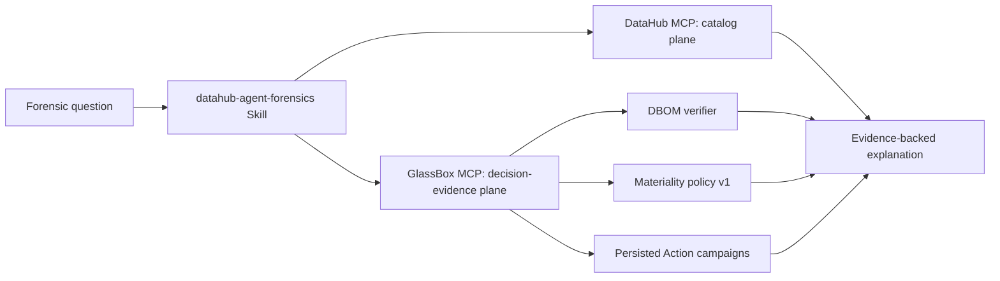

# Agent-decision forensics MCP

**Status:** read-only contract, local stdio transport, shared PostgreSQL live state,
and live dual-server composition
**Contract:** `glassbox.forensics.v1`
**Decision records:** [ADR-0013](adr/0013-read-only-forensics-mcp.md),
[ADR-0014](adr/0014-shared-live-decision-state.md), and
[ADR-0017](adr/0017-operator-trusted-receipt-signers-and-rotation.md)

GlassBox MCP is the decision-evidence companion to DataHub's official MCP server.
Use DataHub MCP for catalog search, entity lookup, schema, and general lineage. Use
this server only after a decision receipt or normalized metadata change is known.



## Tool contract

| Tool | Question answered | Deterministic authority |
| --- | --- | --- |
| `verify_decision_receipt` | Is this stored artifact intact and operator-trusted now? | DBOM integrity plus fingerprint-bound signer policy |
| `get_decision_influence` | What recorded evidence influenced this decision? | Verified dependency profile and optional fresh artifact check |
| `get_decision_publication` | What durable DataHub publication obligation and sealed evidence exists? | Transactional receipt-publication state |
| `classify_decision_impact` | What does one normalized change mean for one receipt? | `glassbox.materiality.v1` |
| `list_affected_decisions` | Which indexed decisions require review for this change? | Complete local index scan plus `glassbox.materiality.v1` |
| `get_invalidation_campaign` | What did the running Action actually persist for this campaign? | Transactional campaign, processing, and sealed writeback state |
| `list_decision_findings` | Which persisted Action findings actually involved this receipt? | Complete configured campaign scan and stored classifications |

The first two impact tools are **prospective**: they deterministically calculate what
a supplied change means against verified receipt evidence. The persisted-finding
tools are **historical**: they report campaigns and assessments already written by
the DataHub Action. Never narrate a prospective calculation as proof that Action
workers processed or wrote back an event.

There are deliberately no mutation tools. In particular, this server cannot create
incidents, quarantine Documents, approve plans, execute replay, resolve campaigns,
or supersede a receipt.

## Proof and completeness states

- `VERIFIED_NOW`: the stored DBOM passed all configured checks during this query.
- `VERIFIED_AT_INGESTION`: the dependency profile came from a verified registration,
  but the service has no artifact reader for a fresh check.
- `ARTIFACT_UNAVAILABLE`: a fresh integrity result cannot be produced.
- `FAILED`: one or more integrity gates failed; bounded `failure_codes` identify the
  gates without echoing raw content.
- `scan_complete: true`: every profile in the configured index was classified.
- `truncated: true`: the complete scan found more review results than the requested
  response limit; this is distinct from incomplete scanning.
- `datahub_writeback_verified: true`: the Action sealed a successful direct readback
  of its DataHub writes before completing the campaign.

The scope string `CONFIGURED_RECEIPT_INDEX` is literal. It must not be narrated as
"all organizational decisions" unless the operator has separately proved that the
configured store is complete.

## Credential-free judge quick test

```bash
uv run --extra mcp python -m examples.judge_mcp_quick_test
```

The command executes a fresh deterministic agent run, creates a process-local
Ed25519 authority, persists the signed receipt and a deterministic impact campaign,
then uses the official MCP client to discover and call all seven read-only tools.
It deletes its temporary state on exit. This is a local protocol proof and reports
`external_datahub_contacted=false`; it does not substitute for the separately
committed live DataHub write/readback evidence.

## Run locally

Install the optional transport and PostgreSQL adapter. For the live profile, point
the server at the exact DSN environment-variable name and schema used by the Action:

```bash
uv sync --extra mcp --extra postgres
export GLASSBOX_STATE_POSTGRES_DSN='postgresql://...'
export GLASSBOX_SIGNER_TRUST_POLICY_PATH=/etc/glassbox/trusted-signers.json
uv run glassbox-forensics-mcp \
  --state-postgres-dsn-env GLASSBOX_STATE_POSTGRES_DSN \
  --state-postgres-schema glassbox \
  --signer-trust-policy "$GLASSBOX_SIGNER_TRUST_POLICY_PATH"
```

The server requires an already initialized compatible schema and performs no DDL.
Use a separate least-privilege database identity with `SELECT` access only. Action
workers own every mutation; MCP reads the same verified artifacts, reverse index,
campaigns, processing attempts, and sealed writeback evidence.

The committed
[PostgreSQL 16 shared-state proof](compatibility/postgresql-16-forensics-live-state.live.json)
records an Action campaign completed in a disposable real server and read through
the forensics service as `STALE`, `COMPLETED`, and writeback `VERIFIED`. It contains
no DSN, credentials, schema name, or receipt body.

## Live dual-server proof

The guarded dual-MCP proof starts the official
[`mcp-server-datahub`](https://github.com/acryldata/mcp-server-datahub) `0.6.0`
server and GlassBox MCP as independent stdio processes. It then creates a genuine
signed receipt, registers it in PostgreSQL, publishes its governed projection to
DataHub Core `v1.6.0`, delivers a material schema change through the real DataHub
Action envelope, and verifies the resulting incident, quarantine, completed
campaign, and zero-write redelivery.

The official DataHub server proves the catalog plane: the affected dataset, exact
`average_order_value` field and `DECIMAL(18,2)` native type, failing active-incident
health, and related receipt Document. GlassBox proves the decision plane: fresh
receipt verification, exact observed-field influence, persisted `STALE` finding,
completed campaign, quarantine, and directly verified DataHub writeback. A
deterministic raw-free composition kernel cross-checks every shared identity and
rejects either server if it exposes mutation authority or loses its read-only
annotations.

Core `v1.6.0` plus official MCP `0.6.0` did not project the exact Incident entity
body through `get_entities`; the proof records this as `UNAVAILABLE`, not as a
failure string or an invented read. The genuine incident remains independently
bound by the Action's direct write/readback evidence, the dataset's active-incident
health, and the exact GlassBox campaign identity. This measured gap is part of the
ecosystem boundary, not hidden demo behavior.

Reproduce it against a local disposable DataHub target and an initialized
PostgreSQL database:

```bash
uv sync --extra actions --extra datahub --extra mcp --extra postgres
export GLASSBOX_STATE_POSTGRES_DSN='postgresql://...'
uv run python -m examples.end_to_end_dual_mcp_forensics \
  --server http://localhost:8080 \
  --allow-live
```

The script creates and drops a random PostgreSQL schema but intentionally writes
synthetic proof metadata to the selected DataHub instance. It does not exercise
Kafka delivery or remote MCP authentication. The committed
[sanitized dual-MCP report](compatibility/datahub-1.6.0-dual-mcp-forensics.live.json)
contains identifiers, states, versions, and counts only—no DSN, credential, receipt
body, prompt, output, or raw tool payload.

## Machine-auditable agent narration

A natural-language agent can still launder `UNAVAILABLE` into certainty after both
MCP servers return correct evidence. The narration contract prevents that in audit
and CI flows without pretending that a model belongs inside a deterministic gate.

Build a closed fact brief from the raw-free dual-MCP report:

```bash
glassbox-agent-narration brief \
  docs/compatibility/datahub-1.6.0-dual-mcp-forensics.live.json \
  --pretty
```

The agent returns a `glassbox.agent-narration.v1` sidecar containing natural prose,
an exact typed claim ledger, required fact citations and limitations, `NONE`
mutation authority, and the raw-content boundary. Validate it with:

```bash
glassbox-agent-narration evaluate \
  docs/compatibility/datahub-1.6.0-dual-mcp-forensics.live.json \
  agent-response.json \
  --pretty
```

The evaluator rejects missing, duplicated, unsupported, or altered claims; omitted
limits; unsupported citations; raw content; and inflated mutation authority. It
hashes but never echoes the prose. A valid result proves only the structured claim
binding and explicitly reports free-prose semantics as
`NOT_DETERMINISTICALLY_PROVEN`.

The committed
[agent narration evaluation](compatibility/datahub-1.6.0-dual-mcp-agent-narration.eval.json)
records two independent forward tests over the genuine live proof. The ordinary
question and a pressure case demanding invented Incident details, organization-wide
scope, and mutation authority both preserved all 18 facts and mandatory limits. A
separate semantic reviewer found no prose contradiction; that result is labeled
model-based and non-authoritative. See
[ADR-0019](adr/0019-machine-auditable-agent-narration.md).

The append-only JSONL store remains useful for local receipt analysis:

```bash
uv sync --extra mcp
uv run glassbox-forensics-mcp \
  --receipt-store .glassbox/receipts.jsonl \
  --signer-trust-policy "$GLASSBOX_SIGNER_TRUST_POLICY_PATH"
```

Signature and operator-trust verification are required by default. The server
refuses startup without a policy unless `--allow-untrusted-signers` is explicitly
selected for development. `--allow-unsigned` is weaker still and exists only for
synthetic fixtures. Returned checks expose trust enforcement and threshold counts.

An MCP client configuration can launch the same command over stdio. Keep the path
local to the client process and restrict file permissions; the JSONL store contains
governed receipt artifacts even though tool outputs are raw-free.

## Investigation sequence

1. Use DataHub MCP search to resolve the native asset, decision Document, or incident.
2. Read the exact DataHub entity/aspects; treat search as discovery, not authoritative
   readback.
3. Call `verify_decision_receipt` before making an integrity claim.
4. Call `get_decision_influence` and preserve every evidence state exactly.
5. Normalize the change from authoritative metadata, then call
   `classify_decision_impact` or `list_affected_decisions`.
6. If the question asks what the system actually did, call
   `get_invalidation_campaign` or `list_decision_findings` and preserve its workflow
   and DataHub writeback verification states.
7. Let the Skill explain the policy verdict, proof state, scope, and uncertainty.
8. Route any desired mutation into a separate explicitly authorized workflow.

## Privacy and failure behavior

Inputs contain identifiers and normalized digests, not receipt bodies or filesystem
paths. Outputs use a fixed projection of evidence identifiers, DataHub URNs, states,
roles, timestamps, and representation digests. Prompts, outputs, query text, action
arguments, tool results, DBOM extensions, and raw evidence values are never returned.

Unknown receipts and malformed content addresses fail closed. Invalid change shapes
are rejected by the same domain model used by the invalidation Action. Integrity
errors become non-sensitive codes such as `PAYLOAD_DIGEST_INVALID` or
`SIGNATURE_MISSING`; validation messages and untrusted values do not cross the MCP
boundary.

## Known limits

- PostgreSQL is the shared live-state profile; JSONL cannot report persisted Action
  campaigns and returns an explicit not-configured state for those tools.
- Remote transports and multi-tenant authorization are intentionally absent.
- The server does not discover DataHub entities; pair it with the official DataHub
  MCP server for that responsibility.
- Official MCP `0.6.0` against Core `v1.6.0` did not project the exact Incident
  entity body in the measured live proof. Dataset incident health and GlassBox's
  independently verified campaign remain available, but callers must preserve that
  exact entity-read state as `UNAVAILABLE`.
- A receipt can prove recorded influence, not that the model's internal reasoning was
  causally faithful or that its output was true.
- The narration evaluator proves its structured ledger and citations, not arbitrary
  free-prose semantics. Independent model review is a forward-test aid, not an
  integrity, materiality, or authorization gate.
