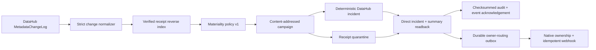

# Deterministic invalidation action

**Status:** Gate 5 policy, writeback, Kafka/pgQueue recovery, and PostgreSQL state live-proven
**Policy:** `glassbox.materiality.v1`
**Decision records:** [ADR-0006](adr/0006-deterministic-invalidation-and-datahub-writeback.md),
[ADR-0007](adr/0007-kafka-delivery-and-acknowledgement.md),
[ADR-0008](adr/0008-transactional-invalidation-state.md),
[ADR-0009](adr/0009-durable-datahub-owner-routing.md), and
[ADR-0010](adr/0010-postgresql-multi-worker-invalidation-state.md), with the
read-only query boundary in
[ADR-0014](adr/0014-shared-live-decision-state.md) and signer authority in
[ADR-0017](adr/0017-operator-trusted-receipt-signers-and-rotation.md). Independent
source acknowledgement recovery is fixed by
[ADR-0024](adr/0024-independent-transport-acknowledgement-recovery.md).

GlassBox converts DataHub metadata changes into evidence-backed impact campaigns.
It does not ask an LLM whether an output is stale. The classifier is a pure,
versioned function over a normalized change and a cryptographically verified DBOM
dependency profile.

## Closed loop



## Verdict contract

| Evidence situation | Verdict | Quarantine |
| --- | --- | --- |
| Exact observed field/asset changed materially | `STALE` | Yes |
| Exact declared or inferred dependency changed | `AT_RISK` | Yes |
| Same dataset, different field, complete non-wildcard lineage | `UNAFFECTED` | No |
| Same dataset, different field, incomplete/wildcard lineage | `AT_RISK` | Yes |
| Changed asset absent from a fully resolved influence set | `UNAFFECTED` | No |
| Any unresolved dependency prevents asset exclusion | `UNKNOWN` | Yes |
| A newer valid receipt already replaces this receipt | `SUPERSEDED` | No |

`UNAFFECTED` is never the default. Absence of a match is only meaningful when
lineage completeness or a fully resolved asset set proves the exclusion.
`AT_RISK` and `UNKNOWN` are never automatically cleared.

Semantic glossary changes are stale when the term was observed as a constraint or
policy. Ownership changes affect routing but not output content. Freshness incidents
are stale only when a freshness constraint was recorded; otherwise they are
`AT_RISK`. Description formatting is non-material under policy v1.

## DataHub Actions plugin

Install the pinned extras and create the local state directory:

```bash
uv sync --extra actions --extra datahub
mkdir -p .glassbox
export GLASSBOX_SIGNER_TRUST_POLICY_PATH=/etc/glassbox/trusted-signers.json
uv run glassbox-invalidation-state init .glassbox/invalidation.sqlite3
```

The package registers this entry point:

```text
datahub_actions.action.plugins
glassbox_invalidation = glassbox_invalidation.datahub_action:GlassBoxInvalidationAction
```

Verify the installed distribution and validate a pipeline before any network call:

```bash
uv run glassbox-datahub-action inspect-install
uv run glassbox-datahub-action validate-config examples/datahub-actions-invalidation.yml
```

Both commands return bounded machine-readable JSON. They do not print tokens, DSNs,
webhook credentials, pipeline contents, or validation inputs. See the
[ecosystem package boundary](upstream/datahub-actions-contribution.md) for current
DataHub upstream conventions and the release checklist.

Use [the example pipeline](../examples/datahub-actions-invalidation.yml) as a
starting point. The action requires the pipeline's `datahub` block because it reuses
the authenticated graph client. It raises on malformed supported MCLs or incomplete
writeback verification, allowing normal DataHub Actions retry handling. Unrelated
event types and unsupported aspects are safe no-ops.

The reference pipeline filters before deserialization to supported MCL aspects and
uses synchronous Kafka commits. Its pipeline name is the consumer-group identity;
keep that name stable across restarts. `auto.offset.reset=latest` is forward-only and
must not be confused with a historical backfill. Choose `earliest` only with an
explicit review of the invalidations it can trigger.

The normalizer currently handles:

- schema field add, remove, and type change from full `schemaMetadata` diffs;
- dataset/entity deprecation;
- glossary definition and ownership changes;
- active DataHub incidents, including schema-field targets;
- receipt Document supersession.

It deliberately ignores `RESTATE`, resolved incidents, GlassBox's own invalidation
incidents, and quarantine-only Document changes. A rename is not inferred from name
similarity; without a trusted rename identity it remains a remove-plus-add pair.

## Transactional state profiles

The action requires exactly one state profile: local SQLite, server PostgreSQL, or
legacy JSONL. SQLite and PostgreSQL implement the same transactional protocol. One
transaction appends a verified signed receipt and all reverse-index rows. A second
state machine atomically stages campaigns with their classification audit, leases
work, recovers expired leases, and seals direct-writeback evidence with the
verification audit. Verified completion creates a separate durable owner-routing
obligation in the same transaction.

Production registration requires `glassbox.signer-trust.v1`. Integrity verification
proves signature math; the operator policy separately binds an authorized key ID to
its public-key fingerprint and lifecycle. New admission uses the current UTC clock.
Historical reads use the signed run time so a `RETIRED` key preserves old receipts,
while `REVOKED` fails both. See the
[rotation runbook](operations/signing-key-rotation.md).

SQLite WAL is the simplest single-host profile. Live compiler deployments should use
`LiveReceiptPipeline`, which registers and directly rereads each signed DBOM before
publishing its DataHub Document. The command below remains the explicit operator
path for historical imports and repairs:

```bash
uv run glassbox-invalidation-state register-receipt \
  .glassbox/invalidation.sqlite3 receipt.json \
  --field-coverage COMPLETE \
  --field-rule glassbox.sql-column-lineage.v1 \
  --wildcard-query false
```

Inspect only bounded operational state, or verify SQLite plus every application
checksum and receipt signature:

```bash
uv run glassbox-invalidation-state status .glassbox/invalidation.sqlite3
uv run glassbox-invalidation-state verify .glassbox/invalidation.sqlite3
```

PostgreSQL 14+ is the distributed-worker profile. Install its optional dependency,
inject the DSN through a secret manager, and initialize the schema once before any
worker starts:

```bash
uv sync --extra actions --extra datahub --extra postgres
export GLASSBOX_STATE_POSTGRES_DSN='postgresql://...'
export GLASSBOX_SIGNER_TRUST_POLICY_PATH=/etc/glassbox/trusted-signers.json
uv run glassbox-invalidation-state postgres-init \
  --dsn-env GLASSBOX_STATE_POSTGRES_DSN \
  --schema glassbox
uv run glassbox-invalidation-state postgres-register-receipt receipt.json \
  --dsn-env GLASSBOX_STATE_POSTGRES_DSN \
  --schema glassbox \
  --field-coverage COMPLETE \
  --field-rule glassbox.sql-column-lineage.v1 \
  --wildcard-query false
uv run glassbox-invalidation-state postgres-verify \
  --dsn-env GLASSBOX_STATE_POSTGRES_DSN \
  --schema glassbox
```

`postgres-init` is the only Actions-facing command that issues DDL. Runtime plugin
construction refuses an absent or unsupported schema instead of silently creating
it. Give bootstrap credentials schema-creation rights, then use a runtime identity
with only the required table and identity-sequence privileges. The plugin config
contains the environment-variable name, never the DSN itself:

```yaml
action:
  type: glassbox_invalidation
  config:
    state_postgres_dsn_env: GLASSBOX_STATE_POSTGRES_DSN
    state_postgres_schema: glassbox
    signer_trust_policy_path: ${GLASSBOX_SIGNER_TRUST_POLICY_PATH}
    postgres_connect_timeout_seconds: 10
```

The PostgreSQL adapter claims exact rows with `SELECT ... FOR UPDATE` and uses the
database server clock for lease acquisition, renewal, and expiration. Worker clock
skew therefore cannot steal a live lease. PostgreSQL schema version 1 and SQLite
schema version 2 are historical contracts superseded by the receipt-publication
outbox. Current PostgreSQL version 3 and SQLite version 4 are engine-specific
contracts. Neither performs an implicit migration, but the explicit
[signed state-transfer contract](operations/state-transfer.md) moves verified
receipt, field-lineage, and supersession state between either engine. Import applies
current receipt-signer admission in one target transaction and creates fresh
publication obligations. The signed operational archive never reactivates campaign,
lease, retry, routing, audit, or completion state.

The read-only forensics MCP server can open this same existing schema with
`--state-postgres-dsn-env`, `--state-postgres-schema`, and
`--signer-trust-policy`. It performs no schema
initialization or campaign mutation. This is the live path for asking which findings
the Action actually persisted, whether processing completed, and whether DataHub
writeback was directly verified. Use a separate `SELECT`-only database identity for
the MCP process; do not export campaign state into a second source of truth.

On first material delivery, the synchronous executor claims the campaign, performs
two idempotent writes, reads DataHub directly, and atomically completes the task. On
redelivery, it performs zero writes but repeats the authoritative read and requires
it to equal the sealed evidence before acknowledging. Owner routing has its own
lease, retry, failure audit, and privacy-minimized completion evidence. A completed
route is never called again during redelivery.

To route through native DataHub ownership, configure an HTTPS webhook and name the
environment variable holding its optional bearer token:

```yaml
action:
  type: glassbox_invalidation
  config:
    state_database_path: .glassbox/invalidation.sqlite3
    owner_webhook_url: https://notifications.example.com/glassbox
    owner_webhook_bearer_token_env: GLASSBOX_OWNER_WEBHOOK_TOKEN
    owner_webhook_timeout_seconds: 10
```

The webhook manifest contains campaign/change identity, aggregate verdict counts,
quarantine count, and sorted native owner URNs. It excludes receipt bodies and raw
evidence. The campaign ID is sent as `Idempotency-Key`. A 2xx response proves adapter
acceptance only—not human receipt. If the process dies after remote acceptance but
before local completion, the request may repeat with the same key; receivers must
deduplicate it.

When no webhook is configured, the explicit no-delivery router settles the routing
task with a visible destination count of zero. Do not describe that as a delivered
owner notification. The SQLite database currently uses schema version 4 and rejects
older versions rather than performing an unsafe implicit migration.

SQLite is a single-host multi-process profile, not a multi-node database. Keep its
files on a local filesystem. PostgreSQL is suitable for workers connecting from
different hosts to one database authority. The committed proof exercises a real
PostgreSQL 16 server and independent connections on one Docker host; it does not
claim a physical multi-host deployment, managed failover, or network-partition
recovery.

## Legacy JSONL receipt dependency store

`VerifiedReceiptStore` holds sealed digest-only DBOMs outside DataHub and builds the
reverse influence index. Registration verifies schema, payload address, Merkle root,
receipt ID, and at least one Ed25519 signature by default. Production callers also
supply the operator trust policy; the signed public key is not self-authorizing. Each append has a
domain-separated checksum; duplicate identical registration is a no-op, conflicting
metadata for the same receipt fails, and truncation or tampering is visible on load.

The JSONL store remains an intentionally single-process compatibility profile. Do not
share it across action workers. New local deployments should use SQLite; distributed
workers should use the PostgreSQL profile.

## Reproduce the PostgreSQL state proof

Point only at a disposable PostgreSQL 14+ database and opt in explicitly:

```bash
export GLASSBOX_STATE_POSTGRES_DSN='postgresql://...'
uv run python -m examples.postgres_invalidation_proof --allow-live
```

The proof creates and drops one randomized `gbx_proof_*` schema. It admits a receipt
under an operator-controlled signer policy, verifies its checksummed admission
attestation on readback, races eight independent connections, requires one claim
winner, proves the database clock overrides a caller timestamp of `1`, recovers the
lease, completes both outboxes, and exercises zero-write redelivery. It prints no DSN,
schema name, or private key. The current
[trusted-signer report](compatibility/postgresql-16-trusted-signer-state.live.json)
records the result; the earlier
[state report](compatibility/postgresql-16-invalidation-state.live.json) preserves the
pre-trust proof history. A deterministic stand-in isolates DataHub mutation in this
database proof; the Kafka proof below is the separate evidence for real DataHub
writeback.

## Writeback invariants

- Campaign, incident, and audit IDs are deterministic.
- The incident targets the changed native asset; receipt Documents are not valid
  `IncidentOn` targets in Core 1.6.0.
- `incidentKey` and `incidentInfo` are upserted directly.
- `incidentsSummary` is fetched and merged because direct incident writes do not
  synthesize the inverse aspect on Core 1.6.0.
- Unrelated active/resolved incidents are preserved and resolved incidents are never
  silently reactivated.
- Receipt quarantine uses fetch-modify-update and preserves all existing properties.
- Receipt republication preserves quarantine and third-party properties.
- Two identical write passes are followed by direct typed/raw reads.
- Verified completion and the owner-routing obligation commit atomically. Dispatch
  runs only after direct reads succeed and receives the campaign ID as its remote
  idempotency key.

## Reproduce the live proof

With DataHub Core 1.6.0 running locally:

```bash
uv run python -m examples.end_to_end_invalidation --allow-live
```

The guarded proof uses only deterministic synthetic entities. It publishes a signed
receipt with observed field evidence, first adds an unrelated `internal_note` field,
then retypes the used `average_order_value` field. Both changes are delivered twice
through a real DataHub Actions `EventEnvelope`.

The committed [live report](compatibility/datahub-1.6.0-invalidation.live.json)
proves:

- the unrelated field is `UNAFFECTED` with zero DataHub writes;
- the used field is `STALE` and quarantines exactly one receipt;
- both deliveries resolve to one campaign and incident URN;
- the incident and target `incidentsSummary` read back successfully;
- the audit contains deduplicated classification and verification phases.

The proof constructs the exact MCL envelope in-process after applying and directly
reading each schema version. It isolates deterministic policy, idempotency, and
writeback behavior from the event source.

## Reproduce the Kafka transport proof

With the same local Core stack plus its Kafka broker on `localhost:9092`:

```bash
uv run python -m examples.end_to_end_broker_invalidation --allow-live
```

This guarded proof does not publish a handcrafted Kafka record. GMS writes the
schema aspects and publishes genuine Avro MCLs; the pinned Actions Kafka source
decodes them through GMS's schema-registry endpoint. The proof then:

1. observes a same-partition readiness change through the source;
2. injects one action exception for the used-field type change;
3. verifies the framework retries the same envelope and GlassBox completes direct
   writeback verification;
4. fails all three configured synchronous commit attempts before they reach Kafka;
5. proves the consumer-group offset did not advance past the target;
6. constructs a fresh pipeline with that same group and receives the exact same
   topic, partition, and offset;
7. proves zero duplicate emissions, fresh direct readback, and one recovery commit;
8. consumes an unrelated-field negative control on a third process and proves the
   recovered material event no longer returns.

The committed [Kafka live report](compatibility/datahub-1.6.0-kafka-invalidation.live.json)
proves real delivery, bounded action retry, commit-retry exhaustion, unchanged
broker state, exact same-offset recovery, synchronous recovery acknowledgement, and
an empty post-recovery restart. The transactional Action reused sealed completion
with zero writes and fresh direct readback. It also resolved one native DataHub
owner, accepted exactly one loopback webhook with the campaign idempotency key, and
made no second request during redelivery. The injection occurs before the client
commit reaches Kafka; physical broker outage and ambiguous-response recovery remain
unverified.

## Reproduce the PostgreSQL Queue transport proof

Use a fresh disposable PostgreSQL 16 database alongside the same DataHub and Kafka
stack. The proof can initialize only its canonical `queue.metadata_queue_*` schema:

```bash
export GLASSBOX_PGQUEUE_PASSWORD='a-disposable-local-password'
uv run python -m examples.end_to_end_pgqueue_invalidation \
  --server http://localhost:18080 \
  --schema-registry-url http://localhost:18080/schema-registry/api/ \
  --pg-host-port 127.0.0.1:55434 \
  --initialize-schema \
  --allow-live
```

This proof first captures a genuine GMS-produced MCL from Kafka, serializes it with
the official MCL schema, and enqueues it through DataHub's `PgQueueRepository`. The
installed `pg_queue` Actions source leases and processes it. GlassBox completes real
DataHub writeback, then the harness fails acknowledgement before the PostgreSQL
transaction. A fresh same-group process is unable to receive the live lease, gets
the exact handle after visibility expiry, reuses completion with zero writes and
fresh readback, persists the ack marker and contiguous offset, and leaves a third
restart empty.

The committed
[pgQueue report](compatibility/datahub-1.6.0-pgqueue-invalidation.live.json) keeps
this claim separate from Kafka. It proves PostgreSQL delivery, lease exclusion,
visibility-timeout redelivery, acknowledgement, and restart behavior. The schema is
DataHub V001 pinned at upstream commit
`93336230f49c27eed0c07d3d2d4350781a256ba5`, with one proof-only default partition
for stock PostgreSQL. Production `pg_partman` setup/maintenance, physical database
outage, failover, and network partitions remain unverified.
