# Provenance compiler and receipt publication

**Status:** Gate 4 vertical slice live-proven
**Version:** `0.1.0-dev`
**Decision records:** [ADR-0005](adr/0005-compiler-and-receipt-publication.md),
[ADR-0015](adr/0015-register-receipts-before-datahub-publication.md), and
[ADR-0016](adr/0016-durable-receipt-publication-and-otlp-acknowledgement.md)

The compiler turns one privacy-safe agent run into a canonical Decision Bill of
Materials and only then publishes a governed summary to DataHub. Raw prompts,
arguments, results, credentials, and evidence values never enter the receipt
Document.

## End-to-end flow

```mermaid
flowchart LR
    A["Agent runtime"] --> B["Normalized runtime events"]
    O["Authenticated OTLP/HTTP JSON"] --> N["Strict OTel normalization"]
    N --> B
    B --> L["Append-only operational event log"]
    B --> C["Deterministic compiler"]
    C --> U["Direct-read URN resolver"]
    U --> D["Canonical DBOM"]
    D --> S["SHA-256 + Merkle + Ed25519"]
    S --> V["Local verification"]
    V --> P["Atomic receipt + publication obligation"]
    P --> Q["Leased publication worker"]
    Q --> H["DataHub receipt Document"]
    H --> R["Second upsert + direct readback"]
    R --> X["Sealed completion + HTTP 200"]
```



## Compiler guarantees

- Exactly one run start and finish are required, with one immutable run context.
- Sequence duplication, conflicting action identity, duplicate terminals, malformed
  digests, unsupported evidence capture methods, and incompatible declarations fail.
- A missing consequential output digest fails rather than creating fake evidence.
- Runtime digests are copied byte-for-byte into DBOM SHA-256 objects.
- Observed, declared, inferred, and unknown evidence remain distinguishable.
- Terminal-only framework callbacks compile; paired attempts and terminals must
  agree on tool, effect, input digest, idempotency key, and approval ID.
- An attempt without a terminal is retained and marked unreplayable.
- Unknown-effect actions are not evaluated for replay, reversible actions require
  fresh approval, and irreversible/failed/blocked actions are unreplayable.
- Owner declarations add versions, verified URNs, and source/schema digests only when
  supplied. Missing component facts remain null.

## OTLP ingestion profile

`parse_otlp_json` accepts the official OTLP protobuf-JSON trace envelope, including
base64 trace/span IDs and nanosecond timestamps. `normalize_otel_spans` selects one
`invoke_agent` span and its direct `execute_tool` children, then reconstructs the
same normalized event contract used by direct SDK capture.

The input fails closed when:

- the GenAI schema URL differs from the pinned profile;
- span identities are duplicated or agent selection is ambiguous;
- an exporter reports dropped attributes or events;
- required GlassBox attributes are absent;
- an OTLP `AnyValue` is outside the scalar profile;
- IDs, timestamps, lifecycle states, or digest commitments are malformed.

## Verified URN resolution

Candidates are evaluated in this order:

1. explicit instrumentation;
2. DataHub tool result;
3. framework annotation;
4. query parse result;
5. configured mapping.

Each exact candidate must return a non-empty direct DataHub entity read. An absent
higher-priority candidate does not block a verified lower-priority one. Two verified
different candidates at the same priority are ambiguous and fail closed. Resolver
errors retain only the exception type, not server text that could contain secrets.

## Operational event persistence

`AppendOnlyEventLog` provides a development durability profile:

- new files are created with mode `0600`;
- each canonical JSONL envelope includes its full run correlation context and a
  domain-separated SHA-256 checksum;
- writes use append mode, a process lock, and `fsync` by default;
- missing logs read as empty;
- tampered envelopes and truncated trailing writes fail visibly;
- nested run context survives round-trip and can be compiled later.

It is intentionally not a multi-process queue or production trace database. A
production deployment should place the OTLP collector and durable trace store behind
the same normalized compiler boundary.

## DataHub publication contract

`LiveReceiptPipeline` composes the pure compiler with transactional state and the
DataHub emitter. For normalized events, call `compile_and_publish`; for an OTLP/HTTP
JSON envelope, call `compile_otlp_and_publish`. Both verify and atomically register
the signed receipt, dependency index, and publication obligation, directly reread
canonical state, claim the exact obligation, then perform the DataHub
double-write/direct-readback contract and seal its evidence.

```python
from pathlib import Path

from glassbox_compiler import LiveReceiptPipeline, PostgresReceiptStateConfig
from glassbox_datahub import ReceiptEmitter
from glassbox_dbom import load_signer_trust_policy
from glassbox_policy import FieldLineageProof

trust_policy = load_signer_trust_policy(Path("/etc/glassbox/trusted-signers.json"))
state = PostgresReceiptStateConfig(signer_trust_policy=trust_policy).connect()
receipt, report = LiveReceiptPipeline(
    state,
    ReceiptEmitter(datahub_backend, signer_trust_policy=trust_policy),
).compile_otlp_and_publish(
    otlp_payload, profile=compilation_profile, field_lineage=FieldLineageProof()
)
```

`FieldLineageProof()` intentionally means coverage `NONE`. Supply `COMPLETE` only
with a named deterministic rule and explicit wildcard result. The presence of a
schema-field URN does not prove completeness.

Registration happens before DataHub mutation. A state conflict produces no DataHub
write. A DataHub failure leaves a verified registered receipt and returns its task
to `READY`; either redelivery or `glassbox-otlp-receiver drain` can repair it. Once
the task is `COMPLETED`, redelivery performs a fresh direct readback and zero DataHub
writes. The caller must not acknowledge publication until `report.valid` is true.
PostgreSQL configuration reads the DSN from `GLASSBOX_STATE_POSTGRES_DSN` by default,
opens an existing initialized schema, and never performs DDL.

## OTLP receiver acknowledgement contract

`glassbox-otlp-receiver serve` exposes only `POST /v1/traces` for OTLP protobuf JSON.
It requires one explicit `Content-Length`, rejects transfer encoding, accepts only
`application/json`, and enforces configured body, span, and socket-time bounds. A
configured bearer token is compared in constant time. Non-loopback binds require
authentication unless an explicit unsafe override is supplied.

The receiver creates a fresh direct-read URN resolver for every request so a
long-lived process cannot reuse stale existence results. Signing keys, DataHub
tokens, the signer-trust policy path, and the PostgreSQL DSN are environment-indirect.
Before binding, the private signing key must match an `ACTIVE` key ID and fingerprint
in `GLASSBOX_SIGNER_TRUST_POLICY_PATH`. Responses contain no OTLP
body, receipt body, credential, server message, or driver message.

- `200` — publication evidence is durably sealed;
- `400` — malformed or contradictory OTLP;
- `401` — authentication failed;
- `413` — body exceeds the configured bound;
- `415` — unsupported media type;
- `503` — DataHub, URN resolution, state, or lease completion is unavailable.

The reference listener is intentionally single-flight. Deploy multiple instances
behind an authenticated TLS/rate-limiting proxy for throughput; PostgreSQL row locks
coordinate publication ownership. The endpoint does not implement OTLP protobuf
binary or gRPC.

SQLite state version 4 and PostgreSQL state version 3 add checksummed signer-admission
evidence to the receipt-publication state introduced by the previous versions. Older
or unknown versions are rejected. There is no implicit migration in this pre-release
profile: bootstrap a fresh schema and re-register authoritative signed receipts
through the admission path.

The sanitized
[PostgreSQL 16 registration proof](compatibility/postgresql-16-live-receipt-registration.live.json)
records `INSERTED` followed by `REUSED` through an existing Action schema. The
genuine DataHub Document double-write/readback remains independently proven by
[the Core 1.6.0 receipt report](compatibility/datahub-1.6.0-receipt-pipeline.live.json);
the database proof does not substitute a fake transport for that claim.

The newer
[trusted publication proof](compatibility/datahub-1.6.0-postgresql-trusted-receipt-pipeline.live.json)
combines both real boundaries: an operator-authorized signer is admitted into
PostgreSQL version 3 with sealed admission evidence, the receipt is written twice to
DataHub Core 1.6.0 and directly read back, and completed redelivery repeats the
authoritative read with zero writes.

The combined
[live OTLP acknowledgement report](compatibility/datahub-1.6.0-postgresql-otlp-receiver.live.json)
proves the actual loopback HTTP receiver against PostgreSQL 16.14 and DataHub Core
1.6.0. The first authenticated request performed exactly two writes and sealed five
aspects; identical completed redelivery performed fresh URN and receipt readbacks
with zero writes.

The rerun in the
[trusted OTLP acknowledgement report](compatibility/datahub-1.6.0-postgresql-trusted-otlp-receiver.live.json)
adds the receiver startup-key policy gate and verifies the receipt's checksummed
signer-admission evidence through PostgreSQL before the same authenticated HTTP,
DataHub direct-readback, and zero-write redelivery assertions.

`ReceiptEmitter` first verifies schema, payload address, receipt ID, Merkle root, all
signatures, and—when configured—the operator signer policy. A signature is required
by default, but key possession alone is not operator trust. It derives the stable Document
URN from the receipt payload digest, performs two upserts, requires identical URNs,
and calls direct entity readback.

The receipt Document stores status, counts, trace/run IDs, content commitments,
replay eligibility, signature count, and governed URN references. Only native
dataset evidence is placed in `relatedAssets` on Core 1.6.0. The live contract report
is [datahub-1.6.0-receipt-pipeline.live.json](compatibility/datahub-1.6.0-receipt-pipeline.live.json).

Run the guarded local proof:

```bash
export GLASSBOX_STATE_POSTGRES_DSN='postgresql://...'
uv run python -m examples.end_to_end_receipt --allow-live
```

The proof uses deterministic synthetic IDs/data, an ephemeral in-memory signing key
bound to an explicit process-local trust policy,
the pinned SDK, a loopback server by default, two upserts, and direct readback. It
does not persist the signing key or raw agent values.

The committed
[combined live report](compatibility/datahub-1.6.0-postgresql-live-receipt-pipeline.live.json)
proves one guarded run against both PostgreSQL 16.14 and DataHub Core 1.6.0: one
signed receipt and dependency registered with canonical readback, followed by two
DataHub upserts and direct readback of five persisted aspects. The generic proof
correctly retains field coverage `NONE` instead of inventing completeness.
