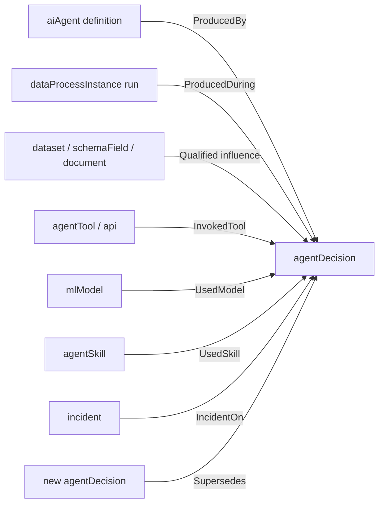

# RFC: Agent decision receipts and runtime influence

- **Feature name:** `agent-decision-receipts`
- **Start date:** 2026-08-06
- **Status:** Draft for pre-RFC discussion
- **RFC pull request:** Not submitted
- **Related RFC:** [#16012 — Agents and Related Assets in Metadata Model](https://github.com/datahub-project/datahub/pull/16012)
- **Implementation evidence:** GlassBox DBOM 0.1, DataHub Core 1.6.0 compatibility adapter, invalidation Action, and read-only forensics MCP

## Summary

Add an immutable, consequential-output-level `agentDecision` entity to DataHub. The
entity records a governed summary of one agent decision receipt, qualified runtime
influence on datasets, fields, documents, models, skills, and tools, privacy-safe
action commitments, current validity, and append-only supersession.

This proposal extends the static registry in RFC #16012. That RFC answers which
agents, skills, tools, and dependencies exist. This RFC answers which exact evidence
and components a particular run used, what it did, whether its receipt passed
integrity checks, and whether a later metadata change invalidated its output.

DataHub remains the governed discovery and impact plane. Raw prompts, model outputs,
tool arguments, query results, and high-cardinality spans remain in the source
artifact and trace stores.

## Motivation

RFC #16012 proposes first-class agents, skills, tools, models, datasets, and static
relationships. Its review raised the unresolved need for an inference-time path from
an agent through a tool call to a dataset or document, and whether that path belongs
in lineage or an audit log.

Both are partly correct:

- a stable, queryable relationship is needed for reverse impact analysis;
- a bare lineage edge is too strong because runtime evidence has different certainty,
  completeness, time, and derivation states;
- a trace-only audit log is too operational and too high-cardinality for catalog
  discovery, governance, ownership, incidents, and reverse queries.

The missing primitive is a governed decision receipt with **qualified influence**.
It is not static dependency metadata, not the full trace, and not a claim that a
model's hidden reasoning is causally faithful.

### User stories

1. An incident responder can answer which signed agent decisions observed a changed
   schema field before a type change.
2. A data owner can distinguish a run that observed a dataset from an agent that was
   merely configured to use it.
3. An auditor can see whether a receipt passed schema, digest, address, Merkle, and
   signature checks without receiving the raw prompt or output.
4. An operator can mark prior decisions stale or at risk through deterministic policy
   and target them with native DataHub incidents.
5. A replay system can publish a new decision that supersedes an old one without
   overwriting either historical record.
6. A catalog or MCP client can retrieve run-specific influence and its completeness
   limits without reconstructing policy in an LLM.

## Goals

- Model one consequential agent output as a durable DataHub entity.
- Build on the agent, skill, tool, model, dataset, document, schema-field, run, and
  incident primitives in DataHub and RFC #16012.
- Preserve `OBSERVED`, `DECLARED`, `INFERRED`, and `UNKNOWN` evidence states.
- Support exact reverse lookup from an entity or field to affected decisions.
- Make incomplete, truncated, unresolved, or unverifiable evidence explicit.
- Separate immutable receipt facts from mutable operational validity projections.
- Preserve append-only replay and supersession history.
- Keep raw and high-cardinality content outside DataHub by default.
- Allow deterministic Actions and read-only MCP clients to share one native contract.
- Remain framework-neutral and telemetry-vendor-neutral.

## Non-goals

- Store chain-of-thought, prompts, messages, rows, query results, or model outputs.
- Turn DataHub into a trace lake or replace an OpenTelemetry backend.
- Prove that a model output is true or that hidden reasoning was faithful.
- Model every inference, token, span, tool event, or non-consequential chat response
  as a DataHub entity.
- Standardize policy language, key trust, approval authorities, or replay execution.
- Grant authorization because an approval or signature reference exists in metadata.
- Replace generic dataset lineage or static `AIAgentDependencies`.
- Require GlassBox, one agent framework, or one receipt serialization.

## Terminology

| Term | Meaning |
| --- | --- |
| Agent definition | The versioned deployable agent cataloged by RFC #16012. |
| Agent run | One execution or invocation, commonly represented by `dataProcessInstance` or an external trace. |
| Agent decision | One consequential output produced during a run and governed by an immutable receipt. |
| Decision receipt | A versioned artifact committing the evidence, runtime components, actions, output digest, and integrity material for a decision. |
| Influence | Qualified evidence that an entity or field affected, constrained, informed, or received the decision. |
| Static dependency | A configured relationship on an agent definition; it does not prove runtime use. |
| Consequential output | An output retained because it can affect a person, system, control, recommendation, transaction, or governed artifact. |
| Projection | Searchable DataHub metadata derived from a receipt; it is not automatically the authoritative signed artifact. |
| Materiality assessment | A deterministic verdict about a decision after an upstream change. |

## Requirements

### Evidence honesty

Each influence MUST carry one of these states:

- `OBSERVED`: captured from the execution path with a source event or span;
- `DECLARED`: configured as a dependency but not proven used in this decision;
- `INFERRED`: derived by a named deterministic rule;
- `UNKNOWN`: evidence cannot establish a stronger state.

Consumers MUST NOT promote an evidence state. A relationship index hit without the
containing aspect and state MUST NOT be described as observed runtime use.

### Immutable history

The key, receipt summary, influence, action commitments, component pins, and
supersession relation MUST be immutable after first complete publication. An exact
redelivery MUST be idempotent. A conflicting write to immutable material under the
same key MUST fail.

Current verification and validity are new assessments of the immutable receipt, so
they MAY change through append-only events plus a replaceable latest-state projection.

### Bounded catalog content

DataHub MUST receive governed low-cardinality metadata. The artifact store MUST retain
the complete receipt. The trace store MUST retain operational spans according to its
own policy. DataHub MUST NOT require raw content to support reverse impact analysis.

## Detailed design

### Chosen model

Introduce a new `agentDecision` entity representing one consequential output. It is
an immutable provenance entity, while the agent run remains an activity. This follows
the W3C PROV distinction between entities, activities, and agents and its qualified
influence pattern.



The model is additive. It does not change the meaning of existing data lineage.

### Identity

The proposed key is:

```text
AgentDecisionKey
  namespace: string
  decisionId: string
  environment: string
```

The corresponding URN is conceptually:

```text
urn:li:agentDecision:(<namespace>,<decisionId>,<environment>)
```

`namespace` identifies the receipt producer or standard, not a display name.
`decisionId` MUST be immutable and unique within that namespace and environment. A
content address is RECOMMENDED. When the receipt format already commits the
environment, repeating it in the key is deliberate: DataHub reviewers identified
environment as an entity identity concern, and explicit identity prevents accidental
cross-environment joins.

Agent version is referenced as runtime component metadata. It is not the decision
identity because one version produces many decisions.

### Entity aspects

| Aspect | Mutability | Purpose |
| --- | --- | --- |
| `agentDecisionKey` | Immutable | Namespace, decision ID, environment. |
| `agentDecisionInfo` | Immutable | Run, agent, timing, output kind/digest, trace/artifact references, redaction state. |
| `agentDecisionComponents` | Immutable | Exact model, skill, tool, workflow, and source version pins used by this decision. |
| `agentDecisionInfluence` | Immutable | Qualified runtime evidence with completeness. |
| `agentDecisionActions` | Immutable | Privacy-safe action, side-effect, outcome, approval-reference, and digest commitments. |
| `agentDecisionIntegrity` | Immutable | Receipt format, canonicalization, payload digest, Merkle root, and signature summary. |
| `agentDecisionPublication` | Replaceable until sealed | Expected aspect digests, publication state, and authoritative readback evidence. |
| `agentDecisionVerificationEvent` | Timeseries | Append-only verifier result at one time and trust configuration. |
| `agentDecisionAssessmentEvent` | Timeseries | Append-only materiality verdict for one normalized change. |
| `agentDecisionStatus` | Replaceable projection | Latest validity/quarantine state with the event ID that justifies it. |
| `agentDecisionSupersession` | Immutable on successor | Prior decision, replay/diff commitments, and reason. |

Common governance aspects such as ownership, domains, tags, terms, status, and
structured properties MAY also be supported. They MUST NOT change immutable receipt
facts.

### `agentDecisionInfo`

Conceptual shape:

```json
{
  "specVersion": "1.0",
  "agent": "urn:li:aiAgent:pricing-agent-v3",
  "run": "urn:li:dataProcessInstance:...",
  "runId": "run-2026-08-06-001",
  "startedAt": 1785974400000,
  "endedAt": 1785974402000,
  "runStatus": "SUCCEEDED",
  "outputKind": "RECOMMENDATION",
  "outputDigest": {
    "algorithm": "SHA256",
    "value": "..."
  },
  "artifactUri": "artifact://decision-receipts/...",
  "traceUri": "trace://provider/trace-id",
  "redactionState": "DIGEST_ONLY"
}
```

`agent`, `run`, and governed targets are typed URN relationships. `artifactUri` and
`traceUri` are references governed by separate authorization; DataHub does not fetch
them automatically.

### Qualified influence

Each influence record contains:

```text
evidenceId: string
entity: Urn | null
schemaField: SchemaFieldUrn | null
state: OBSERVED | DECLARED | INFERRED | UNKNOWN
role: INPUT | REFERENCE | CONSTRAINT | POLICY | MEMORY | OUTPUT_TARGET
observedAt: time | null
representationDigest: Digest | null
sourceTraceId: string | null
sourceSpanId: string | null
derivationRuleId: string | null
confidence: double | null
```

An `INFERRED` influence MUST name a deterministic rule. An `OBSERVED` influence MUST
identify its capture source. A missing or unresolved URN remains `UNKNOWN`; producers
MUST NOT fabricate a URN from a display name.

The aspect also contains:

```text
completeness: COMPLETE | PARTIAL | UNKNOWN
recordedEvidenceCount: long
totalEvidenceCount: long | null
truncated: boolean
fieldLineageCoverage: COMPLETE | PARTIAL | NONE
fieldLineageRuleId: string | null
wildcardQuery: boolean | null
```

These fields make negative claims possible without converting search silence into
proof. A consumer may claim an asset is absent only when the relevant scope is
complete and every dependency is resolved. A consumer may claim a field is unused
only with complete field lineage and a known non-wildcard query.

The relationship index exposes `InfluencedBy` edges for discovery. Consumers fetch
the full aspect before interpreting the edge.

### Runtime components

Static agent dependencies remain on the agent definition. Runtime component records
capture what this decision actually used:

```text
componentId: string
componentUrn: Urn | null
componentType: MODEL | SKILL | TOOL | AGENT | WORKFLOW
version: string | null
sourceDigest: Digest | null
schemaDigest: Digest | null
state: OBSERVED | DECLARED | INFERRED | UNKNOWN
```

This supports parallel agent versions and delegation without interpreting a static
dependency as runtime use. Agent-to-agent delegation is represented by a runtime
component of type `AGENT` plus the child run relationship when available.

### Actions and authorization references

Tool calls remain embedded records, not entities. This avoids a graph node for every
span while preserving audit commitments:

```text
actionId: string
tool: Urn | null
effect: READ_ONLY | REVERSIBLE | IRREVERSIBLE | UNKNOWN_EFFECT
status: ATTEMPTED | SUCCEEDED | FAILED | UNCERTAIN
inputDigest: Digest | null
outputDigest: Digest | null
idempotencyKeyDigest: Digest | null
approvalId: string | null
```

`UNKNOWN_EFFECT` is not safe. An approval reference is evidence that an approval was
recorded; it is not proof that the approval was trusted, current, or bound to the
exact action. Approval validation remains a deterministic external policy concern in
version 1.

### Integrity and verification

`agentDecisionIntegrity` records the receipt profile and commitments:

```text
receiptFormat: string
receiptSpecVersion: string
canonicalization: string
payloadDigest: Digest
merkleRoot: Digest | null
signatureCount: int
signatureKeyIds: array[string]
```

It does not store private keys, raw signed content, or imply validity. A valid
signature proves integrity and possession of a signing key, not factual correctness.

`agentDecisionVerificationEvent` records one deterministic check:

```text
verificationId: string
verifiedAt: time
verifier: Urn | string
verifierVersion: string
artifactDigest: Digest
schemaValid: boolean
payloadDigestValid: boolean
decisionIdValid: boolean
merkleRootValid: boolean | null
signatureRequired: boolean
signaturesValid: boolean | null
state: VERIFIED | FAILED | NOT_VERIFIED
failureCodes: array[string]
```

Failure codes are closed and low-cardinality. Schema messages and untrusted receipt
values MUST NOT be copied into searchable metadata.

### Publication completeness

DataHub aspect writes are not a multi-aspect transaction. A partially published
decision MUST be visible as partial, not accidentally trusted.

The compiler first writes immutable aspects, reads each back by exact URN, verifies
their managed digests, then seals `agentDecisionPublication` as `COMPLETE`. The aspect
contains the expected immutable-aspect digests and direct-read timestamp. Consumers
requiring a complete receipt MUST reject `PENDING`, `PARTIAL`, `FAILED`, a missing
publication aspect, or a digest mismatch.

An exact redelivery is idempotent. A conflicting immutable aspect after completion is
rejected by an entity-specific payload validator.

### Materiality, incidents, and quarantine

`agentDecisionAssessmentEvent` binds one decision, normalized metadata change,
policy version, state, reason code, and matching evidence IDs:

```text
assessmentId: string
decision: AgentDecisionUrn
eventId: string
changedEntity: Urn
changedSchemaField: SchemaFieldUrn | null
changeKind: string
occurredAt: time
policyVersion: string
state: UNAFFECTED | STALE | AT_RISK | UNKNOWN | SUPERSEDED
reasonCode: string
matchedEvidenceIds: array[string]
```

The assessment producer, not DataHub or an LLM, owns the deterministic policy.
DataHub stores and indexes the result.

Extend native incident targeting so `agentDecision` is a valid `IncidentOn` target.
This removes the current need to target only the changed dataset while separately
quarantining a compatibility Document. Incident resolution MUST NOT automatically
return an old decision to a valid state.

`agentDecisionStatus` is a searchable latest projection containing the latest
assessment ID, state, quarantine flag, policy version, update time, and incident URNs.
The append-only assessment events remain the audit history.

### Replay and supersession

A replay creates a new `agentDecision`. The successor owns an immutable
`agentDecisionSupersession` aspect:

```text
priorDecision: AgentDecisionUrn
priorReceiptDigest: Digest
replayBundleDigest: Digest
planDigest: Digest
executionDigest: Digest
diffDigest: Digest
reason: REPLAY | CORRECTION | REISSUE
```

This produces a typed `Supersedes` relationship without modifying the prior decision.
Cycles and self-supersession are rejected. A prior decision may have multiple
successors, but the UI and APIs MUST expose the fork rather than silently selecting
one as canonical.

### Search, graph, API, and MCP behavior

Minimum API behavior:

- get a decision by exact URN with all immutable aspects and latest status;
- search decisions by agent, environment, time, output kind, validity, owner, domain,
  incident, and component;
- traverse `ProducedBy`, `ProducedDuring`, `InfluencedBy`, `InvokedTool`, `UsedModel`,
  `UsedSkill`, and `Supersedes` relationships;
- reverse query exact dataset, field, document, tool, model, skill, or agent URNs;
- paginate and return completeness metadata;
- fetch verification and assessment event history.

Once the native model lands, DataHub's official MCP server may expose read-only tools
such as `get_agent_decision` and `list_affected_agent_decisions`. Mutation tools are
out of scope and should remain disabled by default. MCP results MUST preserve evidence
state, publication state, verification state, pagination, and truncation.

### Retention and scale

Only consequential outputs SHOULD be emitted. Producers define that policy and record
its version. Every model call and tool span remains in the trace store.

DataHub stores the bounded summary and relationships. The complete receipt stays in
an artifact store. When influence exceeds configured bounds, producers record exact
counts and `truncated: true`; they do not drop edges while claiming completeness.

Deployments may apply retention to decisions after policy and legal review, but
supersession and incident references must not dangle silently. Archival SHOULD retain
the key, artifact digest, lifecycle state, and resolvable archive reference.

## Ingestion flow

1. Instrumentation emits OpenTelemetry GenAI agent, model, and tool spans with raw
   content capture disabled by default.
2. A provenance compiler resolves exact DataHub URNs and preserves unresolved inputs
   as unknown.
3. The compiler builds and signs a complete external receipt.
4. The compiler emits immutable `agentDecision` aspects with deterministic IDs and
   idempotency metadata.
5. The compiler directly reads back each aspect and seals publication completeness.
6. A verifier publishes a verification event.
7. DataHub Actions consumes supported metadata changes, queries reverse influence,
   computes deterministic assessments, creates incidents, and updates the latest
   status projection.
8. An approved replay produces a new decision and successor-owned supersession aspect.

## Privacy and security

- Raw prompts, messages, rows, query text, tool arguments/results, credentials, and
  output bodies are opt-in trace/artifact data and MUST NOT enter these aspects.
- Digests of low-entropy values can be guessed. Producers SHOULD use protected
  artifact storage or keyed commitments when this threat matters.
- Artifact and trace references MUST use separate authorization from catalog read
  access. DataHub MUST NOT dereference them automatically.
- DataHub descriptions, document content, glossary text, and receipt extensions are
  untrusted data, not execution instructions.
- Verification key possession is not trust. Trust roots and revocation are external
  inputs recorded by verifier identity and version.
- An incident, status, approval reference, or MCP response does not grant replay or
  mutation authority.
- Producers MUST use exact URNs and authoritative reads; display-name-derived URNs are
  rejected.
- Relationship and search results are discovery surfaces. Deterministic impact
  decisions read the exact decision aspect and completeness proof.

## Compatibility and migration

The working compatibility model publishes receipt summaries as typed DataHub
Documents with allowlisted custom properties. Those Documents remain projections and
cannot prove artifact integrity.

Migration is additive:

1. Define a deterministic mapping from the compatibility Document and receipt ID to
   the native `agentDecision` key.
2. Dual-write native and compatibility entities for one release window.
3. Directly compare managed values, relationships, and reverse-impact results.
4. Backfill historical signed receipts; leave projection-only Documents explicitly
   unverified when the artifact is unavailable.
5. Switch readers to native entities after capability probing.
6. Stop new compatibility writes; do not delete or rewrite historical Documents.
7. Map immutable supersession Documents to successor-owned native relationships.

The agent, skill, and tool relationship names depend on the final resolution of RFC
#16012. This RFC should rebase onto that accepted vocabulary rather than fork it.

## Alternatives considered

### A. Reuse only `dataProcessInstance`

Treat each run as the decision and attach new aspects to it.

Advantages:

- reuses an existing run primitive;
- naturally represents start/end and execution status.

Drawbacks:

- a run can produce zero, one, or many consequential outputs;
- replay/supersession applies to an output receipt, not necessarily the whole run;
- content-addressed immutable output identity does not match mutable run state;
- current run support is timeseries-oriented and not a complete governed asset UX.

Decision: retain a relationship to `dataProcessInstance`, but do not collapse the
decision into the run.

### B. Add only aspects to `aiAgent`

Store latest runtime dependencies and validity on the agent definition.

Advantages:

- few entities;
- simple agent-centric UI.

Drawbacks:

- overwrites history;
- merges parallel versions and environments;
- cannot identify one stale output;
- converts static configuration into alleged runtime use.

Decision: rejected.

### C. Use ordinary lineage edges

Represent agent-to-tool-to-data paths as existing lineage.

Advantages:

- immediate graph traversal;
- familiar impact-analysis surface.

Drawbacks:

- bare edges cannot express observed/declared/inferred/unknown state;
- temporal and receipt completeness are lost;
- a configured dependency appears equivalent to captured use;
- generic lineage semantics imply data derivation more strongly than some reference,
  policy, constraint, memory, or output-target roles warrant.

Decision: use relationship indexing for discovery, backed by a qualified influence
aspect that consumers must read.

### D. Store only audit events or OpenTelemetry traces

Keep all decision evidence outside the metadata graph.

Advantages:

- no new high-cardinality DataHub entity;
- trace tools already handle execution detail.

Drawbacks:

- weak catalog discovery, ownership, domains, incidents, and reverse impact;
- retention and identity differ across trace vendors;
- queries require access to sensitive operational telemetry;
- no stable governed bridge to static Agent Registry assets.

Decision: retain raw telemetry externally and compile only governed receipts into
DataHub.

### E. Continue using Document projections

Advantages:

- works on stable DataHub Core today;
- no server metadata-model change.

Drawbacks:

- relationships are encoded as custom properties;
- incident targets and reverse traversal are awkward;
- projection fields can be mistaken for cryptographic verification;
- every adopter invents its own property namespace.

Decision: keep as a migration adapter, not the native model.

### F. Make every tool call an entity

Advantages:

- exact graph path for every invocation;
- direct per-call search and ownership.

Drawbacks:

- turns DataHub into a trace lake;
- creates prohibitive entity and edge cardinality;
- exposes a broader sensitive-data surface;
- duplicates OpenTelemetry.

Decision: embed bounded action commitments in the decision and link tools by URN.

## Drawbacks

- Consequential decisions can still be high-cardinality and require explicit
  admission, retention, and indexing policy.
- Immutable aspect validation is stricter than ordinary DataHub upsert behavior and
  adds server complexity.
- Relationship indexes cannot carry all qualified influence attributes, so consumers
  must fetch the aspect after graph discovery.
- Multi-aspect publication needs an explicit completeness protocol because DataHub
  does not provide a general atomic entity transaction.
- A native entity adds UI, GraphQL, OpenAPI, SDK, search, authorization, retention,
  and migration work.
- Receipt standards and key trust are still evolving; this proposal must avoid
  baking one vendor format into DataHub.
- The model improves auditability but cannot prove semantic correctness or hidden
  model causality.

## Implementation milestones

### Milestone 0: Align with Agent Registry

- Resolve vocabulary and entity identity dependencies with RFC #16012.
- Validate the qualified-influence boundary with DataHub metadata-model maintainers.
- Agree whether this should be a new RFC or a focused extension to #16012.

### Milestone 1: Metadata model

- Add key, immutable summary, components, influence, actions, integrity,
  supersession, publication, verification-event, assessment-event, and status PDL.
- Register `agentDecision` as a core searchable entity.
- Generate Java/Python/GraphQL/OpenAPI bindings.
- Add relationship and search index annotations.

### Milestone 2: Correctness and operations

- Add immutable-aspect conflict validation and idempotent redelivery tests.
- Add publication completeness and direct-read verification.
- Extend incident targets and incident summary behavior.
- Define retention, archival, and authorization defaults.

### Milestone 3: SDK and migration

- Add a builder that accepts a validated receipt projection, not raw prompt content.
- Add compatibility-Document migration and dual-write tooling.
- Prove parity against a real DataHub Core deployment.

### Milestone 4: Ecosystem consumers

- Update DataHub Actions reverse-impact integration.
- Add read-only official MCP retrieval tools.
- Update the `datahub-agent-forensics` Skill to prefer native entities.
- Add a minimal decision investigation view only after API semantics are stable.

## Test plan

- Key determinism across supported SDKs and languages.
- Exact redelivery idempotency and conflicting immutable-write rejection.
- Partial multi-aspect publication remains visibly incomplete.
- Direct readback detects missing or altered managed fields.
- Observed, declared, inferred, unknown, unresolved, partial, wildcard, and truncated
  influence cases.
- Dataset and exact schema-field reverse lookup with pagination and fanout limits.
- Diamond, cycle, duplicate, out-of-order, and multi-successor graph cases.
- Static dependency never appears as observed runtime influence.
- Incident creation, inverse summary, resolution, and no false revalidation.
- Supersession preserves both decisions and rejects self/cyclic links.
- One-byte artifact tampering changes verification state without changing receipt
  history.
- Secret-like canaries in prompts, extensions, action payloads, query text, and errors
  never appear in searchable aspects or MCP results.
- Migration parity from compatibility Documents and explicit projection-only cases.
- Load tests based on consequential-output rates, not token or span rates.

## Working implementation evidence

This proposal is backed by an external Apache-2.0 reference implementation:

- DBOM 0.1 uses RFC 8785 canonical JSON, SHA-256 content addresses, Merkle
  commitments, optional Ed25519 signatures, and a standalone verifier.
- A stable-Core adapter double-writes and directly reads back governed receipt
  Documents without treating the projection as verified.
- A deterministic materiality engine distinguishes `STALE`, `AT_RISK`, `UNKNOWN`,
  `UNAFFECTED`, and `SUPERSEDED`, including positive field-exclusion proof.
- A DataHub Action consumes real Metadata Change Log envelopes, creates native
  incidents, quarantines projections, persists transactional state in SQLite or
  PostgreSQL, and acknowledges Kafka only after direct writeback verification.
- Read-only replay produces a new signed receipt, raw-free diff, and immutable
  successor-owned supersession record without changing the source receipt.
- A read-only MCP v2 server exposes receipt verification, qualified influence,
  deterministic impact, and complete local reverse scans through the official SDK.
- Core 1.6.0 live reports and PostgreSQL 16/Kafka proofs are committed as sanitized
  machine-readable evidence.

The reference implementation is evidence for the problem and invariants. It is not
proposed as the normative DataHub schema or required dependency.

## Unresolved questions

1. Should the RFC be a standalone proposal or a section of RFC #16012 while that RFC
   remains open?
2. Is `agentDecision` the correct name, or should DataHub use a more domain-neutral
   `decisionReceipt` or `consequentialOutput` entity?
3. Should environment remain in the key when a receipt's content address already
   commits it?
4. Which runtime component entity represents an MCP/function tool after RFC #16012:
   `agentTool`, `api`, or a common interface?
5. Should qualified influence use one bounded array aspect, a timeseries evidence
   event, or a first-class relationship entity to preserve edge attributes?
6. What is the acceptable relationship fanout and payload size before completeness
   must move to an external index?
7. Should immutability be enforced by a core payload validator, optimistic write
   condition, or entity-level policy?
8. Can native Incidents target `agentDecision` directly with existing generic
   `IncidentOn`, or does the inverse summary need model changes?
9. Who is allowed to publish verification and assessment events, and how should
   verifier trust and key revocation be represented?
10. Which current-status transitions are legal, and how are erroneous upstream change
    events corrected without rewriting assessment history?
11. What default retention and archival behavior is appropriate for high-volume
    consequential decisions?
12. Should the first release include action commitments and approval references, or
    focus only on integrity and influence?

## References

- [DataHub RFC #16012: Agents and Related Assets in Metadata Model](https://github.com/datahub-project/datahub/pull/16012)
- [DataHub RFC process](https://github.com/datahub-project/datahub/blob/master/docs/rfc.md)
- [DataHub metadata model concepts](https://github.com/datahub-project/datahub/blob/master/docs/what-is-datahub/datahub-concepts.md)
- [DataHub lineage API](https://github.com/datahub-project/datahub/blob/master/docs/api/tutorials/lineage.md)
- [OpenTelemetry GenAI agent and framework spans](https://github.com/open-telemetry/semantic-conventions-genai/blob/main/docs/gen-ai/gen-ai-agent-spans.md)
- [OpenLineage facets and extensibility](https://openlineage.io/docs/spec/facets/)
- [W3C PROV-O](https://www.w3.org/TR/prov-o/)
- [RFC 8785: JSON Canonicalization Scheme](https://www.rfc-editor.org/rfc/rfc8785)
- [RFC 8032: Edwards-Curve Digital Signature Algorithm](https://www.rfc-editor.org/rfc/rfc8032)
