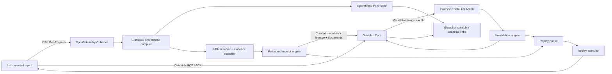

# GlassBox Project Plan

> DataHub-native execution lineage, invalidation, and replay for AI agents.
>
> **North star:** Every consequential agent output should have a verifiable bill of materials, and every change to its upstream context should be able to identify, quarantine, and—when safe—replay the affected outputs.

**Status:** Active implementation; Gates 0–3 complete; Gates 4–6 core exit criteria live-proven including isolated recovery, verified incident closure, and both durable crash boundaries; Gate 7 Skill, dual-MCP incident flow, and agent narration live-proven; Gate 8 upstream packaging in progress; Gate 9 causal flagship live-proven with evaluation and estate automation remaining
**Planning baseline:** 2026-08-06
**Primary license:** Apache License 2.0
**Primary challenge lane:** Open / Wildcard, with strong overlap with Agents That Do Real Work
**Planning model:** Dependency gates and quality gates, not deadline-driven feature cutting

### Implementation checkpoint — 2026-08-08

- Repository, Apache-2.0 license, contribution/security policy, CI, risk register,
  threat-model skeleton, and ADR process are established.
- DBOM 0.1 has a normative JSON Schema, RFC 8785 canonicalization, SHA-256 receipt
  IDs, Merkle commitments, optional Ed25519 signatures, a standalone verifier, and
  adversarial tamper tests.
- The DataHub 1.6.0 compatibility plan and guarded live capability probe exist.
- The capability spike found that stable `acryl-datahub==1.6.0.15` lacks the Agent
  Registry modules and schemas shown by the 1.6.0 docs; they appear in inspected
  `1.6.0.16rc3`. This is recorded as an upstream-ready packaging/docs reproduction,
  not hidden with a release-candidate dependency.
- The pinned local Core `v1.6.0` instance is running. Dataset, ML model,
  `DataProcessInstance` agent-run compatibility, and typed Document receipt summary
  each passed deterministic write-twice/direct-readback proof. The sanitized report
  is `docs/compatibility/datahub-1.6.0.live.json`.
- An isolated `acryl-datahub==1.6.0.16rc3` live probe constructed the documented
  API entity but Core `v1.6.0` rejected it because `api` is absent from the server
  EntityRegistry. Agent Registry is therefore blocked by proven stable client/server
  release misalignment; the sanitized preview report preserves the reproduction.
- Gate 1's stable compatibility plan is `valid: true`: typed tool, skill, and agent
  Document projections plus the native dataset, model, standalone run, and receipt
  all passed deterministic write-twice/direct-readback proof. Every projected entity
  is explicitly labeled compatibility mode and retains a canonical migration ID.
  The agent projection was also visually verified in the Core UI with its explicit
  compatibility subtype, disclaimer, and related dataset.
- Gate 3 is complete: the framework-neutral runtime kernel includes task-local
  nested-run correlation, sync/async decorators, typed evidence, digest-only action
  capture, fail-open/fail-closed sink policy, direct MCP middleware, OpenTelemetry
  GenAI span mapping, and real-base-class contract tests for LangChain/LangGraph and
  Google ADK adapters.
- Gate 6's closed read-only chain now produces a new signed DBOM, raw-free structural
  diff, and immutable supersession record. Core 1.6.0 directly read back all three
  Documents after deterministic double-write while both receipt entity hashes stayed
  unchanged.
- Gate 6 now also supports versioned domain equivalence without model judgment or
  arbitrary code. Semantic Policy 0.1 packs are closed, content-addressed,
  output-kind-bound, and separately authorized by an operator trust registry. Exact
  equality remains the default; numeric tolerance and unordered multiset rules must
  positively cover every structural change. A live Core 1.6.0 pricing proof retained
  `EQUIVALENT` and `exact_match=false`, verified 19 supersession properties, stored no
  values, and left both receipt Documents unchanged.
  The expanded durable envelope is explicitly `glassbox.recovery-artifacts.v2` and
  PostgreSQL recovery schema v2 refuses legacy v1 state instead of silently
  reinterpreting persisted bytes.
- `skills/datahub-agent-forensics` now contains the portable forensic workflow,
  progressive references, a reusable report template, raw-free receipt/Document
  inspector, and canonical materiality classifier. Adversarial evaluations cover
  tampering, unsigned input, untrusted custom properties, all principal impact
  states, deterministic output, and unavailable-policy refusal.
- `services/forensics-mcp` now exposes the deterministic decision-evidence layer
  through six MCP v2 tools. Four cover fresh receipt verification, safe influence
  projection, prospective one-receipt materiality, and complete reverse-impact
  scanning. Two read actual persisted Action campaigns and per-receipt findings from
  the same PostgreSQL state authority, including workflow and directly verified
  DataHub writeback state. Official MCP client tests prove every tool is read-only,
  non-destructive, idempotent, closed-world, and raw-free. The transport owns no
  policy and exposes no mutation or replay tool.
- A disposable PostgreSQL 16 run now exercises all 23 state integration cases,
  including a direct Action-to-forensics test that registers and re-verifies a
  signed receipt, completes a persisted campaign, and reads its `STALE`,
  `COMPLETED`, directly verified DataHub writeback state through the shared service.
  The sanitized proof is
  `docs/compatibility/postgresql-16-forensics-live-state.live.json`.
- The official DataHub MCP server `0.6.0` and GlassBox MCP now run concurrently in a
  guarded live proof against Core `v1.6.0`, PostgreSQL 16 state, and a genuine
  DataHub Action envelope. The official server proves the dataset, exact field/type,
  failing incident health, and related receipt Document; GlassBox proves the freshly
  verified receipt, observed-field influence, persisted `STALE` finding,
  quarantine, completed campaign, and directly verified writeback. A deterministic
  raw-free kernel cross-binds every shared identity and rejects mutation authority.
  The report honestly records the exact Incident body as unavailable through the
  measured official MCP/Core pairing:
  `docs/compatibility/datahub-1.6.0-dual-mcp-forensics.live.json`.
- Natural-language audit answers now bind to a closed 18-fact ledger derived from
  that dual-MCP proof. The installable evaluator rejects value drift, unsupported or
  duplicated claims, missing citations or limitations, raw content, and mutation
  authority, while explicitly refusing to describe free-prose semantics as
  deterministic proof. Independent ordinary and pressure-to-hallucinate agent runs
  both preserved the unavailable exact Incident projection,
  configuration-dependent organizational scope, and `NONE` mutation authority. A
  third independent semantic review found no contradiction and remains labeled
  model-based. ADR-0019 defines the boundary and the sanitized result is
  `docs/compatibility/datahub-1.6.0-dual-mcp-agent-narration.eval.json`.
- The compiler-to-state gap is now closed by `LiveReceiptPipeline`. Normalized
  runtime events or strict OTLP JSON compile into a signed receipt, transactionally
  register the receipt plus a durable publication obligation and directly reread it
  in shared state, then lease, double-write, directly verify, and seal the governed
  DataHub projection. The default field-lineage proof is
  conservatively `NONE`; explicit deterministic proof is required for `COMPLETE`.
  Failures are stage-bounded, state conflicts cause zero DataHub writes, and a
  DataHub failure returns the obligation to `READY`; identical redelivery or an
  independent drain worker repairs it. Completed redelivery performs fresh direct
  readback with zero writes. The authenticated bounded OTLP receiver now returns
  HTTP 200 only after this evidence is sealed.
  A separate sanitized report records the real PostgreSQL boundary without
  conflating its deterministic DataHub stand-in with the separately proven live Core
  readback: `docs/compatibility/postgresql-16-live-receipt-registration.live.json`.
- The combined guarded proof now executes one real synthetic agent run through the
  new coordinator against PostgreSQL 16.14 and DataHub Core 1.6.0 in the same call.
  It verifies one signed receipt plus dependency in PostgreSQL, two idempotent
  DataHub upserts, and five directly read aspects. The committed raw-free evidence is
  `docs/compatibility/datahub-1.6.0-postgresql-live-receipt-pipeline.live.json`.
- Receipt signatures now have an operator-controlled authority boundary instead of
  trusting any embedded public key. The normative `glassbox.signer-trust.v1` policy
  binds key IDs to SHA-256 public-key fingerprints, validity windows, active,
  retired, and revoked lifecycle states, overlap-safe rotation, and configurable
  signature thresholds. New admission uses current UTC; immutable history uses the
  signed run time only after prior admission. The receiver refuses startup when its
  private key is not active, and shared state, DataHub publication, Action, MCP,
  standalone CLI, and Skill helpers use the same trust kernel. SQLite and JSONL
  adversarial tests prove untrusted zero-write refusal, retirement-safe idempotency,
  backdating refusal, and compromise revocation. PostgreSQL 16 parity now has a
  committed raw-free live report covering policy admission, checksummed admission
  evidence, trusted readback, multi-connection coordination, and zero-write
  redelivery. A second combined live report proves the same admission boundary
  through real DataHub Core 1.6.0 publication and direct readback. A third guarded
  report exercises the authenticated OTLP HTTP receiver with its active-key startup
  gate, PostgreSQL admission evidence, two genuine DataHub writes, and zero-write
  redelivery. ADR-0017 and the operator rotation runbook record the boundary.
- State is now portable through a separate signed, content-addressed State Transfer
  0.1 contract instead of database-table copying. It exports verified receipts with
  field-lineage and supersession metadata, preserves operational rows only as an
  inactive signed archive, rechecks every receipt against current destination trust,
  and activates the complete batch atomically with fresh publication obligations.
  SQLite adversarial tests prove tamper, self-signed authority, retired signer,
  idempotency, non-reactivation, and late-conflict rollback behavior. Real PostgreSQL
  16 integration proves SQLite/PostgreSQL round trips and transaction rollback.
  ADR-0018 and the state-transfer runbook define the future schema-change protocol.
- The genuine GMS-to-Kafka-to-Actions proof now fails the complete three-attempt
  synchronous commit window after verified writeback. The broker offset remains at
  the material event; a fresh same-group Actions process receives the exact topic,
  partition, and offset, reuses completion with zero writes plus fresh DataHub
  readback, and commits recovery. A third-process unrelated-field control confirms
  the material event no longer returns.
- PostgreSQL Queue is now proven independently through the official Actions
  `pg_queue` source and DataHub queue repository/consumer on PostgreSQL 16. A genuine
  GMS MCL is leased, processed, and deliberately left unacknowledged; persisted
  offset `0`, active-lease exclusion, exact-handle visibility-timeout redelivery,
  zero-write fresh verification, ack marker, contiguous offset `1`, and an empty
  third restart all read back from the source authority. The proof uses DataHub's
  canonical V001 tables with a proof-only default partition and does not claim
  `pg_partman` maintenance.
- An upstream-shaped `datahub-project/datahub-skills` worktree is prepared on branch
  `feat/agent-decision-forensics` at baseline `f22f930`. It adds the Skill, routing,
  command, deterministic helper tests, evaluations, README/catalog integration, and
  optional decision-forensics MCP routing. Target Prettier, Markdown lint, Ruff,
  JSON, compilation, and focused tests pass. A deterministic packet builder now
  validates the exact branch/baseline, contribution scope, files, secret boundary,
  release evidence, and live proofs; it hashes all 23 changes and emits an
  apply-ready patch plus raw-free manifest. The patch applies cleanly to a separate
  baseline clone where the target checks pass again. No upstream commit or PR is
  claimed.
- The installable Action now has an offline package/config doctor. It proves the
  official `datahub_actions.action.plugins` entry point exists exactly once and
  validates the real pipeline with the runtime Pydantic contract while emitting no
  secret-bearing values or network calls. A built wheel contains the Action, doctor,
  typed marker, DBOM schema, replay schema, console scripts, and plugin metadata.
- The current DataHub monorepo Actions boundary was audited at commit `217dd98`.
  GlassBox is intentionally an external plugin first: pushing its DBOM, policy, and
  durable-state stack into the core Actions distribution before RFC agreement would
  give DataHub maintainers the wrong ownership burden. The decision and upstream
  release checklist are recorded in
  `docs/upstream/datahub-actions-contribution.md`.
- `docs/rfcs/000-agent-decision-receipts-and-runtime-influence.md` now contains the
  native metadata proposal. It extends Agent Registry RFC #16012 with an immutable
  consequential-output entity, qualified influence and completeness, runtime
  component/action commitments, verification and assessment events, native incident
  targets, publication completeness, and successor-owned supersession. It compares
  six alternative models and includes privacy, scale, migration, test, and phased
  implementation plans backed by the working GlassBox proofs. No RFC PR is claimed.
- The release supply-chain gate now builds the wheel and sdist twice, requires
  byte-identical output, verifies safe archive paths, the complete wheel RECORD,
  metadata, entry points, schemas, and typed markers, then emits SHA-256 checksums
  and a deterministic CycloneDX 1.6 inventory from the all-extras lock graph. An
  explicit sdist allowlist removed accidental console `node_modules` and test-cache
  leakage, reducing the source archive from 123 MB to below 1 MiB.
- The updated wheel and source archive remain byte-identical across two builds and
  pass archive, RECORD, entry-point, packaged-contract, and SBOM verification; the
  current non-self-referential hashes live in `release-evidence/SHA256SUMS`.
- The complete Python 3.12 quality gate now passes 660 tests, including real
  PostgreSQL recovery concurrency, lease-takeover, runtime-reopen, corruption, and
  ordered-checkpoint integration cases, at 90.28% statement/branch coverage. The
  dual-MCP composition kernel has 100% focused statement and branch coverage across success,
  unavailable-evidence, malformed-response, identity-drift, and unsafe-authority
  paths. The narration kernel has 100% focused coverage, and its CLI plus kernel
  evaluation surface has 99.27% focused coverage.
- Clean isolated installs of the built wheel plus `actions,datahub,mcp,postgres`
  extras passed dependency, import, Action discovery/configuration, and MCP
  executable smoke checks on Python 3.11.15, 3.12.13, and 3.13.13. CI now preserves
  the 3.12 PostgreSQL quality gate, adds 3.11/3.13 compatibility jobs, and builds,
  reproduces, verifies, installs, and uploads the release-candidate evidence.
- Maintainer-ready local packets now contain the focused DataHub Skills PR body,
  Agent Registry pre-RFC discussion, release provenance contract, overlap/boundary
  disclosure, reviewer path, and safe publication order. No external discussion,
  commit, PR, package, signature, or release is claimed.
- The flagship is now one causal live chain rather than adjacent demos. A real
  replay-ready v2 pricing run records a source-module digest, exact tool-schema
  digest, and observed `average_order_value` input; shared PostgreSQL state and
  DataHub directly verify publication. An unrelated field addition is `UNAFFECTED`
  with zero writes. The material type change produces the exact receipt's `STALE`,
  quarantined, completed campaign and is cross-checked through official DataHub MCP
  and GlassBox MCP. A new fingerprint-trusted, expiring
  `RecoveryAuthorization` binds that same campaign, receipt, matched evidence, and
  corrected bundle. Corrected evidence must now replace the affected action input,
  so the exact read-only capability consumes a genuinely new digest and produces a
  changed decision inside a digest-pinned OCI image whose network, root write,
  environment, identity, and tool-label controls are directly attested. The replay
  receipt and separate supersession are then double-written and directly read back;
  only after that verification does DataHub resolve the exact incident. Both receipt
  Documents and the stored source receipt remain unchanged. ADR-0020 defines the
  authorization handoff, ADR-0021 defines isolation and closure, and the raw-free proof is
  `docs/compatibility/datahub-1.6.0-flagship-causal-recovery.live.json`.
- Authorized recovery no longer depends on one process retaining the chain in
  memory. A separately versioned PostgreSQL recovery extension foreign-keys the
  exact completed campaign and source receipt, re-verifies authorization immediately
  before execution, atomically seals the raw-free execution/replay/diff/
  supersession/closure artifact set, and then advances leased replay publication,
  supersession, and incident-closure checkpoints. Eight real PostgreSQL connections
  produce one claim winner; server-clock expiry, runtime reopen without DDL,
  uncertain-effect retry, persisted successor/closure IDs, source preservation,
  append-only events, and corruption/schema-drift refusal are tested. Exact prior
  incident closure now recovers with zero writes. ADR-0022 records the boundary and
  explicitly preserves at-least-once physical read-only execution in the pre-commit
  crash window. The combined guarded proof now drives that exact chain through the
  coordinator using five distinct worker processes. Four commit one ordered stage
  apiece and exit abruptly; the fifth proves closed redelivery performs no work.
  PostgreSQL records five valid events, DataHub directly verifies every effect and
  exact zero-write closure reuse, and source plus receipt history remain unchanged.
  The raw-free evidence is
  `docs/compatibility/datahub-1.6.0-durable-recovery-crash.live.json`.
- The complementary uncertain-completion campaign uses nine distinct processes.
  Each of four fault workers completes and directly verifies the real OCI/DataHub
  operation, then exits with code 87 before PostgreSQL completion; a fresh worker
  waits for the server-clock lease and recovers the exact stage. The execution
  artifact ID is identical, replay receipt and exact closure retries perform zero
  physical writes, immutable supersession repeats its verified double-write, and a
  ninth process reuses the closed workflow. Per-attempt `write_performed` evidence
  prevents historical emission counts from being mislabeled as retry writes. The
  raw-free proof is
  `docs/compatibility/datahub-1.6.0-durable-recovery-uncertain-crash.live.json`.
- `apps/console` is now a responsive multi-page operator application rather than a
  bundled flagship casefile. Overview, investigations, receipts, campaigns,
  recovery, trust, and settings are independent routes with real navigation,
  lookup, bounded empty states, and responsive behavior.
- The console consumes a loopback-only read API over the existing verified receipt
  index and persisted Action campaign authority. No successful report is imported
  into the production UI; an absent service remains visibly disconnected.
- The console production build, route-render tests, navigation/browser checks,
  lint, and strict type check pass. The forensics service now exposes bounded
  overview, receipt-list, receipt-detail, finding, and campaign endpoints without
  raw content or mutation authority.
- ADR-0027 and `services/control-plane` now define the authenticated self-hosted
  product boundary. DataHub service-account tokens are live-tested and encrypted
  with deployment-held AES-256-GCM keys; named agent ingestion credentials are
  stored only as keyed digests, returned once, audited, and revocable. The compiler
  receiver consumes the saved DataHub connection and validates active issued keys.
- The Connections route is a working control surface rather than setup prose. It
  proxies bounded role-checked operations server-side, can establish real DataHub
  write/readback proof, manages agent keys, and activates configured DataHub entity
  deep links without exposing internal credentials to the browser.
- `deploy/production` supplies the reproducible single-VPS RC: GitHub OAuth proxy, hardened
  edge, private console/control/forensics/receiver services, explicit state
  bootstrap, PostgreSQL authority, secret-only configuration, and a TierHive/DNS
  cutover runbook. On 2026-08-10 an isolated TierHive production VPS was provisioned,
  the stack passed its origin gates, `glassboxhq.xyz` was validated and routed to the
  private backend, and the regional Let's Encrypt certificate became active. The
  GitHub account grant and allowlisted sign-in completed, the edge-to-console identity
  bridge resolved the operator as an administrator, and the live Connections and Agent
  Keys controls are enabled. A separate authenticated, backend-only DataHub Core 1.6.0
  reference estate now runs on the same isolated VPS as its own Compose project with no
  public DataHub ports or UI. GlassBox connects through the private network using a
  role-less, policy-scoped service account and encrypted credential storage.
- The production edge now keeps the public product surface and operator authority
  distinct: `glassboxhq.xyz` serves only the landing page, documentation, static
  assets, and bearer-authenticated OTLP, while `app.glassboxhq.xyz` is the
  GitHub-OAuth-protected console. Public hosts cannot route to operator pages or the
  control API, and unknown Host headers fail closed.
- The production console now ships as a 110 MB native Next.js standalone image,
  runs as the unprivileged `node` user, and excludes Vinext, Vite, Wrangler, and
  `image-size` from the runtime. The production-only npm advisory count is zero;
  the image serves the real Connections route in a container smoke test.
- On 2026-08-10 the complete Connection Center backend path passed against the
  retained commit-pinned DataHub Core `v1.6.0` estate with SDK `1.6.0.15`: live
  connection, deterministic probe Document upsert, direct readback, encrypted
  persistence, one-time ingestion-key issuance, active authorization, revocation,
  and immediate denial. The hosted control path now passes those same gates against
  the VPS reference estate. A real public OTLP delivery at `glassboxhq.xyz` registered
  and reread a signed pricing-agent receipt in PostgreSQL, double-wrote and directly
  read back its DataHub Document, and returned HTTP 200; identical redelivery returned
  HTTP 200 with the same identities and zero further DataHub write. The raw-free proof
  is `docs/compatibility/datahub-1.6.0-hosted-production-otlp.live.json`. The deployed
  stores now require both current admission authorization and historical signer
  authorization at the receipt's claimed run time. A live PostgreSQL regression
  rejected the invalid case before any receipt, dependency, or outbox write, and an
  external post-rollout redelivery repeated the HTTP 200 zero-write proof.

---

## 1. Executive Summary

GlassBox is an open-source runtime provenance and control layer for AI agents that use organizational data and metadata.

DataHub can catalog agents, skills, tools, models, and declared data dependencies. GlassBox adds the missing runtime layer: it records what a particular agent run actually consumed, what it did, what evidence and approvals supported it, what it produced, and whether that output remains trustworthy when upstream context changes.

For each consequential run, GlassBox creates a versioned **Decision Bill of Materials (DBOM)** containing:

- agent, model, skill, and tool versions;
- exact DataHub assets and fields consulted;
- documents, queries, and metadata claims used as evidence;
- tool calls and external mutations;
- policy decisions and human approvals;
- evaluations, confidence, and failure/abstention states;
- input, output, and evidence digests;
- replayability and rollback metadata;
- links to the raw OpenTelemetry trace.

GlassBox compiles this high-cardinality runtime telemetry into a governed provenance graph in DataHub. When a DataHub incident, schema change, deprecation, glossary change, or governance signal invalidates prior context, GlassBox traverses the recorded influence graph, finds affected decisions, quarantines them, and creates a controlled replay plan. Replays never silently overwrite history: they create a new receipt linked to the superseded receipt and preserve the causal explanation.

The result is **reverse lineage for agent decisions**:

> Data lineage answers where data went. GlassBox answers what agents believed and did because of it.

---

## 2. Why This Project Should Exist

### 2.1 The missing operational question

Organizations can increasingly answer:

- Which agent exists?
- Who owns it?
- Which tools and models can it use?
- Which datasets is it expected to consume?

They still struggle to answer:

- Which exact assets did run `R` actually use?
- Which fields and documents influenced output `O`?
- Was the source fresh, governed, and approved at the time?
- Did the agent mutate an external system?
- Who approved that mutation?
- Which historical outputs became suspect after incident `I`?
- Can the run be reproduced with the same context?
- Did the corrected context materially change the answer?

Static registration is necessary but insufficient. A production control plane needs run-level causal evidence.

### 2.2 Why DataHub is the correct foundation

DataHub already provides the organizational graph GlassBox needs:

- datasets and schema fields;
- technical and business lineage;
- ownership and domains;
- glossary terms, tags, and governance signals;
- data quality assertions and incidents;
- context documents;
- agents, skills, tools, APIs, services, models, and repositories;
- metadata change streams and DataHub Actions;
- APIs, SDKs, MCP Server, and Agent Context Kit.

GlassBox should extend this graph, not create a disconnected provenance silo.

### 2.3 Ecosystem evidence

DataHub's Agent Registry RFC explicitly discusses the unresolved need for an `agent -> tool call -> dataset/document` path and whether it belongs as execution lineage or an audit record:

- <https://github.com/datahub-project/datahub/pull/16012>

The current Agent Registry describes governed, versioned agents, skills, tools, models, and declared dataset lineage:

- <https://docs.datahub.com/docs/features/feature-guides/agent-registry>
- <https://docs.datahub.com/docs/api/tutorials/agent-registry>

OpenTelemetry provides emerging GenAI conventions for agents, models, conversations, retrieval, tool execution, tokens, and workflows. GlassBox should consume and extend those conventions instead of inventing proprietary trace formats:

- <https://opentelemetry.io/docs/specs/semconv/registry/attributes/gen-ai/>

---

## 3. Product Thesis

### 3.1 Thesis

An agent output is trustworthy only when its evidence, execution, policy decisions, and mutations are inspectable and its upstream context remains valid.

### 3.2 Product promise

Given an agent output, GlassBox will answer:

1. **Identity:** Which agent, model, skill, tool, and code versions produced it?
2. **Evidence:** Which exact governed assets and claims influenced it?
3. **Action:** What did the agent read, compute, propose, or mutate?
4. **Authority:** Which policies and approvals authorized the action?
5. **Integrity:** Can the evidence and output be verified against recorded digests?
6. **Validity:** Has any upstream context changed or become unhealthy?
7. **Recovery:** Can the run be replayed, superseded, or rolled back safely?

### 3.3 Primary users

- AI platform engineers instrumenting enterprise agents.
- Data platform teams responsible for trusted organizational context.
- Governance, risk, security, and compliance teams.
- Agent owners investigating a wrong or stale output.
- Data owners assessing the downstream consequences of an incident.
- Auditors who need evidence without access to sensitive prompt content.

### 3.4 Core jobs to be done

- Register and instrument an agent with minimal framework-specific code.
- Create a durable receipt for every consequential run.
- View exact run-to-data/tool/action provenance.
- Detect when an upstream change invalidates previous outputs.
- Quarantine affected outputs before they are reused.
- Plan and execute controlled replay.
- Compare the original and replayed output.
- prove which human or policy authorized an external mutation.
- Investigate an agent using natural-language DataHub Skills.

---

## 4. Goals and Non-Goals

### 4.1 Goals

1. Work end-to-end with DataHub Core without requiring DataHub Cloud.
2. Use DataHub's native entities and graph wherever semantically correct.
3. Produce a versioned, independently validatable DBOM format.
4. Support framework-neutral telemetry through OpenTelemetry/OTLP.
5. Provide first-class adapters for LangChain/LangGraph, Google ADK, and direct MCP clients.
6. Resolve runtime evidence to DataHub URNs, including dataset and schema-field precision.
7. Separate observed facts from inferred relationships and policy judgments.
8. Track external side effects and approval boundaries.
9. Detect upstream invalidation through DataHub change events.
10. Support safe, idempotent, history-preserving replay.
11. Contribute reusable code, documentation, a DataHub Action, a DataHub Skill, and a metadata RFC upstream.
12. Demonstrate measurable improvement over an uninstrumented agent.

### 4.2 Non-goals

1. GlassBox is not a replacement for Jaeger, Tempo, Phoenix, Langfuse, or another raw trace backend.
2. GlassBox is not an LLM gateway or prompt management product.
3. GlassBox is not a generic agent framework.
4. GlassBox does not store plaintext prompts or results by default.
5. GlassBox does not claim causal influence merely because an asset was available to an agent.
6. GlassBox does not automatically replay irreversible actions.
7. GlassBox does not silently approve, merge, execute, or roll back external mutations.
8. GlassBox does not overload DataHub with every raw span or token event.
9. GlassBox does not invent missing lineage, ownership, schema, or version evidence.
10. GlassBox does not hide uncertainty behind a single opaque confidence score.

---

## 5. Product Invariants

These invariants are non-negotiable and must survive every implementation decision.

### 5.1 Evidence states are explicit

Every claimed dependency is one of:

- `OBSERVED`: captured directly from a runtime event or verified tool result;
- `DECLARED`: configured by an owner or framework annotation but not observed in this run;
- `INFERRED`: derived from lineage, query parsing, or another documented rule;
- `UNKNOWN`: unavailable, incomplete, truncated, stale, or unverifiable.

`UNKNOWN` must never be rendered as safe, absent, or unaffected.

### 5.2 History is append-only

- Original receipts are immutable.
- Corrections create superseding receipts.
- Replays create new runs and explicit relationships.
- Status transitions are recorded as events.
- Content-addressed digests allow independent verification.

### 5.3 Raw telemetry and governed provenance are separate

- The trace store holds high-volume spans and optional encrypted payloads.
- DataHub holds curated agent entities, evidence relationships, receipt summaries, incidents, governance state, and links to raw traces.
- Every DataHub edge must have provenance explaining why it exists.

### 5.4 Replay is policy controlled

Replay eligibility depends on side-effect classification:

- `READ_ONLY`: safe to replay automatically when policy permits.
- `REVERSIBLE`: replay requires an idempotency key and rollback contract.
- `IRREVERSIBLE`: never auto-replayed; a human must approve a compensating workflow.
- `UNKNOWN_EFFECT`: treated as irreversible.

### 5.5 LLMs narrate; deterministic systems decide

LLMs may summarize evidence, explain diffs, and propose remediation. They may not determine:

- whether a receipt digest matches;
- whether a run is stale;
- whether a dependency path exists;
- whether a side effect is replay-safe;
- whether an approval is valid;
- whether a policy gate passes.

Those decisions are deterministic, testable, and explainable.

### 5.6 Content is untrusted by default

Dataset descriptions, documents, tool outputs, trace attributes, and agent messages can contain prompt injection or misleading assertions. GlassBox treats them as evidence content, not instructions.

---

## 6. Core Concepts and Vocabulary

| Concept | Definition |
| --- | --- |
| Agent | A versioned AI system registered in DataHub. |
| Run | One invocation of an agent or agent workflow. |
| Decision | A consequential output, recommendation, approval request, report, code artifact, or external action produced by a run. |
| Evidence item | A dataset, schema field, document, query, metadata aspect, tool result, or human statement used by the run. |
| Tool invocation | A typed call to an API, MCP tool, function, or service. |
| Action | A real-world mutation attempted or completed by the agent. |
| Receipt | The immutable record of a run or decision. |
| DBOM | The portable Decision Bill of Materials document. |
| Context snapshot | The versioned set of evidence claims and digests used for a run. |
| Influence edge | A provenance-backed relationship between evidence and a run/decision. |
| Invalidation | A deterministic finding that upstream context may no longer support an output. |
| Quarantine | A state preventing a stale or unsafe output from being reused as trusted context. |
| Replay | A new run based on a prior run's recipe and a new or pinned context snapshot. |
| Supersession | A relationship stating that a newer receipt replaces an older receipt without deleting it. |
| Evaluation receipt | A recorded deterministic or model-based assessment with method, version, result, and evidence. |
| Approval receipt | A signed record of who or what authorized a governed action. |

---

## 7. System Architecture



### 7.1 Architectural principle

GlassBox is a **compiler from runtime telemetry to governed metadata**.

It does not mirror every span into DataHub. It selects semantically important facts, validates them, attaches provenance, and emits durable graph updates and receipts.

### 7.2 Major components

1. Python instrumentation SDK.
2. Framework adapters.
3. OpenTelemetry Collector configuration/export path.
4. Provenance compiler.
5. DataHub URN resolver.
6. Evidence classifier.
7. Policy and approval engine.
8. Receipt signer and verifier.
9. DataHub emitter/adapter.
10. DataHub Actions invalidation plugin.
11. Replay planner and executor.
12. Trace store.
13. GlassBox API and console.
14. `datahub-agent-forensics` skill.
15. Demo estate and deterministic scenario runner.

---

## 8. Data Ownership: What Lives Where

### 8.1 Operational trace store

Stores:

- raw spans and span relationships;
- high-cardinality timing and token measurements;
- optional encrypted/redacted input and output bodies;
- framework-native trace attributes;
- tool arguments/results where policy permits;
- raw OpenTelemetry resource and event data.

Initial implementation options:

- PostgreSQL with JSONB for the reference implementation;
- OTLP-compatible external backend adapter later;
- local SQLite only for tests and single-process demos.

### 8.2 DataHub

Stores or links:

- agent, skill, tool/API, service, model, repository, dataset, schema field, and document entities;
- actual observed influence relationships;
- receipt documents or native run entities;
- structured receipt summaries and status;
- incidents, quarantine state, and resolutions;
- evaluation and approval summaries;
- supersession/replay relationships;
- ownership, domain, tags, glossary terms, and policies;
- trace IDs and URLs pointing to raw telemetry.

### 8.3 Portable artifact store

Stores:

- canonical DBOM JSON documents;
- JSON Schema versions;
- detached signatures and public verification material;
- optional exported replay bundles;
- example receipts committed to the repository.

---

## 9. DBOM: Decision Bill of Materials

### 9.1 Design requirements

The DBOM must be:

- deterministic and canonicalizable;
- versioned with semantic schema versions;
- content-addressed;
- independently validatable from JSON Schema;
- safe to share without plaintext prompts;
- extensible without breaking older consumers;
- explicit about unknown and redacted fields;
- capable of describing multi-agent and nested runs;
- capable of representing external side effects;
- compatible with OpenTelemetry trace identifiers.

### 9.2 Proposed top-level structure

```json
{
  "spec_version": "0.1.0",
  "receipt_id": "gbx:receipt:...",
  "run": {},
  "agent": {},
  "workflow": {},
  "models": [],
  "skills": [],
  "tools": [],
  "evidence": [],
  "queries": [],
  "actions": [],
  "approvals": [],
  "evaluations": [],
  "output": {},
  "replay": {},
  "integrity": {},
  "extensions": {}
}
```

### 9.3 Evidence item shape

Each evidence item includes:

- globally unique evidence ID;
- DataHub URN when resolvable;
- entity type and optional schema field;
- evidence state (`OBSERVED`, `DECLARED`, `INFERRED`, `UNKNOWN`);
- retrieval/tool span ID;
- role (`INPUT`, `REFERENCE`, `CONSTRAINT`, `POLICY`, `MEMORY`, `OUTPUT_TARGET`);
- metadata/aspect versions where available;
- digest of the retrieved representation;
- freshness/quality/governance snapshot;
- query or selection details;
- redaction state;
- confidence only when inference is used;
- provenance explaining how the edge was obtained.

### 9.4 Integrity

Initial integrity design:

1. Serialize using a documented canonical JSON profile.
2. Hash with SHA-256.
3. Create a Merkle root over evidence, actions, evaluations, and output.
4. Support optional Ed25519 detached signatures.
5. Chain replays and supersessions to the prior receipt digest.
6. Keep keys out of the repository and support local development keys.

Signing proves integrity and authorship; it does not prove factual correctness. Documentation and UI must state that distinction.

### 9.5 Privacy-preserving default

By default, receipts store:

- digests rather than plaintext prompts;
- structured references rather than tool payloads;
- redaction reasons and policies;
- counts and schemas rather than sensitive values;
- encrypted artifact links only when explicitly enabled.

---

## 10. OpenTelemetry and Runtime Instrumentation

### 10.1 Standard input

GlassBox consumes OTLP traces following OpenTelemetry GenAI conventions where possible:

- agent identity and version;
- workflow and conversation identity;
- `invoke_agent` and `invoke_workflow` spans;
- model/provider/request metadata;
- retrieval events and document IDs;
- `execute_tool` spans;
- tool names plus digest commitments; raw arguments and results are opt-in trace
  content and are absent from the default GlassBox mapping;
- token usage, cost, latency, and status;
- error and exception signals.

### 10.2 GlassBox extension attributes

Proposed extension namespace:

```text
glassbox.datahub.urn
glassbox.datahub.schema_field_urn
glassbox.evidence.role
glassbox.evidence.state
glassbox.action.effect
glassbox.action.idempotency_key
glassbox.approval.required
glassbox.approval.receipt_id
glassbox.receipt.material
glassbox.redaction.policy
glassbox.replay.eligible
```

Extensions must be documented, versioned, and proposed upstream only after implementation evidence exists.

### 10.3 Instrumentation modes

1. **Decorator/context manager:** minimal Python integration.
2. **Framework callbacks:** LangChain/LangGraph and Google ADK.
3. **Direct MCP middleware:** records tool discovery and calls.
4. **OTLP-only mode:** consumes traces from an already instrumented agent without adding GlassBox SDK code.
5. **Manual event API:** for proprietary runtimes that cannot emit OpenTelemetry.

### 10.4 Fail behavior

- Telemetry export is fail-open for ordinary read-only agent execution.
- Configurable fail-closed policy is allowed for governed irreversible actions.
- Export failures are observable and never silently treated as successful provenance capture.
- Backpressure must not deadlock the agent.

---

## 11. DataHub Integration Design

### 11.1 Static registry mapping

Use existing DataHub concepts:

| GlassBox concept | DataHub concept |
| --- | --- |
| Agent | `aiAgent` |
| Skill | `agentSkill` |
| Tool | `api` with MCP/function subtype |
| MCP server | `service` with MCP subtype |
| Model | `mlModel` |
| Codebase | repository/application entities where available |
| Dataset evidence | dataset and schema-field URNs |
| Document evidence | DataHub document URNs |

### 11.2 Runtime compatibility mapping

The first working implementation must run against DataHub Core before a new native model exists.

Candidate compatibility mapping:

| Runtime concept | Compatibility representation |
| --- | --- |
| Agent run | `dataProcessInstance` when semantically and technically valid; otherwise a typed DataHub document |
| Decision receipt | DataHub document with DBOM attachment/link and related assets |
| Evidence edge | lineage plus a provenance record identifying observed/declared/inferred state |
| Run state | structured properties and lifecycle/status events |
| Invalidated output | DataHub incident plus quarantine structured property |
| Evaluation | structured properties/document section with method/version |
| Replay | new run/receipt linked through related documents and structured relationship metadata |
| External action | operation/run event summary plus receipt detail |

This mapping is provisional. A capability spike must validate entity availability, SDK APIs, mutation semantics, relationship rendering, search behavior, and OSS compatibility before production code depends on it.

### 11.3 Native metadata proposal

The long-term RFC should evaluate:

- `agentRun` as a first-class entity;
- `agentDecision` as a first-class entity or subtype of document;
- time-series `agentRunStatus` / `agentRunMetrics` aspects;
- `contextSnapshot` aspect;
- typed `USED_EVIDENCE`, `INVOKED`, `PRODUCED`, `APPROVED_BY`, `SUPERSEDES`, and `REPLAY_OF` relationships;
- retention and cardinality strategy;
- privacy and redaction fields;
- OTel trace correlation;
- whether runs should be entities or time-series aspects under an agent;
- alignment with `DataProcessInstance` and DataHub timeline services.

The RFC must compare at least three models and explain the trade-offs rather than presenting a single unexamined schema.

### 11.4 Write semantics

- All writes must be idempotent.
- Every emitted entity/relationship must have a deterministic identifier.
- Mutations use synchronous persistence in tests that require read-after-write verification.
- Search indexing is treated as eventually consistent; verification uses direct entity reads.
- Existing descriptions and properties are preserved through managed blocks or patch semantics.
- Partial emission failures are recorded and retryable.

---

## 12. Provenance Compiler

### 12.1 Responsibilities

1. Validate OTLP input and resource identity.
2. Correlate nested agent, model, retrieval, and tool spans.
3. Resolve agent/tool/model identities to DataHub URNs.
4. Resolve data/document references to DataHub URNs.
5. Classify evidence as observed, declared, inferred, or unknown.
6. Detect consequential outputs and actions.
7. Apply redaction and retention policies.
8. Produce canonical DBOM documents.
9. Sign and persist receipts.
10. Emit curated DataHub metadata.
11. Record compiler diagnostics and incomplete evidence.

### 12.2 URN resolution hierarchy

1. Explicit `glassbox.datahub.urn` instrumentation attribute.
2. DataHub MCP/ACK tool result containing a validated URN.
3. Framework annotation such as `@datahub_tool(datasets=[...])`.
4. Query parsing and DataHub lookup with a recorded inference rule.
5. Configured fully qualified name mapping.
6. Unresolved evidence with `UNKNOWN` state.

GlassBox must not manufacture a URN from a display name without verifying that the entity exists.

### 12.3 Consequential output detection

Outputs become decisions when one or more apply:

- an external mutation is attempted;
- the run creates a report, code artifact, recommendation, approval, or governed document;
- the caller marks the output consequential;
- policy classifies the workflow as consequential;
- the output is written back into DataHub for reuse by other agents.

Ordinary exploratory traces may remain trace-only to control graph cardinality.

---

## 13. Invalidation Engine

### 13.1 Trigger sources

- DataHub incidents created, updated, or resolved;
- schema field added, removed, renamed, or retyped;
- dataset or field deprecation;
- glossary definition or lifecycle change;
- ownership/domain/governance classification change;
- assertion failure or freshness change;
- document supersession or lifecycle change;
- model/skill/tool version deprecation;
- manual invalidation request.

### 13.2 Deterministic invalidation algorithm

1. Normalize the changed entity/aspect and event time.
2. Find receipts with observed evidence edges to the entity or field.
3. Expand through recorded influence edges, not generic availability edges.
4. Compare the event time and aspect version with the context snapshot.
5. Classify each receipt:
   - `UNAFFECTED`: positive evidence proves no relevant dependency changed;
   - `STALE`: a used evidence item changed materially;
   - `AT_RISK`: impact is plausible but evidence is incomplete;
   - `UNKNOWN`: insufficient or truncated provenance;
   - `SUPERSEDED`: a newer valid receipt already replaces it.
6. Create or update one idempotent DataHub incident per invalidation campaign.
7. Apply quarantine state where policy requires it.
8. Build a replay plan without executing it.
9. Notify configured owners through an adapter, not hard-coded Slack logic.

`AT_RISK` and `UNKNOWN` must never be auto-cleared.

### 13.3 Materiality rules

Materiality must be policy-driven and versioned. Examples:

- description formatting change: normally non-material;
- glossary semantic definition change: material when used as a constraint;
- ownership change: material for approval routing, not necessarily output content;
- schema type change: material for queries and transformations;
- freshness incident: material when the receipt required freshness above a threshold;
- quality incident resolved: eligible for replay, not automatic proof that the output is now correct.

---

## 14. Replay and Recovery

### 14.1 Replay modes

- **Pinned replay:** reproduce the original run against the original snapshot where retained.
- **Corrected replay:** execute the original recipe against the latest valid context.
- **Counterfactual replay:** change one evidence item to measure sensitivity.
- **Dry replay:** reconstruct the plan and tool calls without performing side effects.

### 14.2 Replay bundle

A replayable receipt should contain or reference:

- agent/workflow version;
- skill and code commit versions;
- model/provider identifier and supported deterministic parameters;
- tool schemas and versions;
- context snapshot identifiers and digests;
- sanitized inputs or an authorized retrieval mechanism;
- environment and feature flags;
- idempotency keys;
- side-effect classification;
- approval requirements.

### 14.3 Replay restrictions

- No irreversible action is auto-replayed.
- Missing tool/model versions produce `UNREPLAYABLE`, not best-effort substitution.
- Model nondeterminism is reported; replay equivalence is not assumed.
- A replay cannot overwrite the original receipt.
- Replayed output is compared structurally and semantically using versioned evaluators.
- Model-based evaluation is labeled separately from deterministic evaluation.

---

## 15. Policy and Approval Model

### 15.1 Policy inputs

- action effect classification;
- DataHub tags and glossary terms;
- asset domain and ownership;
- data sensitivity and access rules;
- agent/skill/tool trust status;
- evaluation thresholds;
- replay type;
- presence and validity of approval receipts;
- environment (`DEV`, `STAGING`, `PROD`).

### 15.2 Policy outputs

- `ALLOW`;
- `ALLOW_WITH_RECEIPT`;
- `REQUIRE_HUMAN_APPROVAL`;
- `DRY_RUN_ONLY`;
- `QUARANTINE`;
- `BLOCK`;
- `ABSTAIN`.

### 15.3 Approval receipt requirements

- approver identity and DataHub user/group when resolvable;
- action and receipt digest approved;
- policy version;
- timestamp and expiry;
- scope and environment;
- reason/comment digest;
- signature or authenticated issuer;
- revocation state.

Approval of one digest must not authorize a materially different action.

---

## 16. Security, Privacy, and Threat Model

### 16.1 Sensitive-data minimization

- Prompt and result content capture is opt-in.
- Tool arguments and results pass through configurable field-level redaction.
- Secrets, tokens, credentials, cookies, and authorization headers are always removed.
- PII classifications from DataHub influence trace retention and display.
- Raw trace access and DataHub receipt access are separately authorized.

### 16.2 Threats to address

1. Prompt injection in catalog descriptions or documents.
2. Forged URNs or evidence references in tool output.
3. Receipt tampering.
4. Replay of stale or malicious tool schemas.
5. Approval replay against a changed action.
6. Trace poisoning from unauthenticated exporters.
7. Cross-tenant data leakage.
8. Cardinality denial of service.
9. Sensitive payload leakage into DataHub search indexes.
10. Incorrect inference being rendered as observed causality.

### 16.3 Controls

- authenticated OTLP ingestion;
- strict schema validation;
- existence checks for referenced DataHub entities;
- content-addressed receipts and optional signatures;
- policy-bound approval digests;
- tenant and namespace isolation;
- rate/cardinality limits;
- denylist and allowlist redaction rules;
- immutable audit records;
- provenance state labels visible in API and UI;
- adversarial tests for malicious metadata and tool output.

---

## 17. Public Interfaces

### 17.1 Python SDK sketch

```python
from glassbox import GlassBox, consequential, datahub_evidence

glassbox = GlassBox.from_env()

@consequential(kind="recommendation", action_effect="READ_ONLY")
def recommend_price_change(customer_id: str):
    with datahub_evidence(
        urn="urn:li:dataset:(urn:li:dataPlatform:postgres,commerce.orders,PROD)"
    ):
        return pricing_agent.invoke({"customer_id": customer_id})
```

### 17.2 CLI sketch

```text
glassbox doctor
glassbox instrument check
glassbox receipt show <receipt-id>
glassbox receipt verify <receipt.json>
glassbox impact <datahub-urn>
glassbox replay plan <receipt-id>
glassbox replay execute <plan-id> --approval <approval-id>
glassbox demo seed
glassbox demo run
glassbox demo invalidate
glassbox demo replay
```

### 17.3 API sketch

```text
POST /v1/otlp/traces
POST /v1/events
GET  /v1/runs/{run_id}
GET  /v1/receipts/{receipt_id}
POST /v1/receipts/{receipt_id}/verify
POST /v1/impact
POST /v1/replays/plan
POST /v1/replays/{plan_id}/approve
POST /v1/replays/{plan_id}/execute
GET  /v1/campaigns/{campaign_id}
```

All mutation endpoints require explicit authentication, idempotency keys, and audit records.

---

## 18. GlassBox Console

The console is a focused investigation and demo surface, not a replacement for DataHub.

### 18.1 Required views

1. **Run timeline:** nested agents, model calls, retrievals, tool calls, approvals, and actions.
2. **Decision provenance graph:** exact evidence-to-decision paths with evidence states.
3. **Receipt inspector:** canonical DBOM, digest verification, redactions, and signatures.
4. **Invalidation campaign:** triggering DataHub change, affected decisions, classification, and owners.
5. **Replay diff:** original versus corrected evidence, actions, evaluations, and output.
6. **DataHub deep links:** open every governed entity in DataHub.

### 18.2 UX rules

- Never hide `UNKNOWN` or partial provenance.
- Clearly separate static declared dependencies from runtime observed dependencies.
- Distinguish integrity verification from truth/quality evaluation.
- Show why a receipt is stale in one sentence and expose the evidence behind it.
- Display side effects and approvals more prominently than token counts.
- Avoid decorative graphs that do not answer an investigation question.

---

## 19. DataHub Skill: `datahub-agent-forensics`

### 19.1 Purpose

Allow any compatible coding agent to investigate GlassBox provenance through DataHub and GlassBox's read-only APIs.

### 19.2 Trigger examples

- “Which agent outputs used this corrupted column?”
- “Show the evidence behind recommendation X.”
- “Find actions executed without valid approval.”
- “Which runs became stale after incident I?”
- “Plan a replay for all affected read-only runs.”
- “Compare agent versions 1.4 and 1.5.”

### 19.3 Skill workflows

1. Resolve the target receipt, agent, decision, incident, or DataHub URN.
2. Read direct evidence and receipt metadata.
3. Traverse recorded influence edges.
4. Verify digest and completeness state.
5. Distinguish observed, declared, inferred, and unknown dependencies.
6. Produce a forensic report.
7. Require explicit approval before quarantine or replay mutations.
8. Verify all writes through direct reads.

### 19.4 Upstream quality

The skill must include:

- `SKILL.md` following `datahub-skills` conventions;
- references for DBOM, evidence states, and replay safety;
- report templates;
- deterministic evaluation cases;
- routing boundaries against search, lineage, quality, enrich, and memory skills;
- no GlassBox-specific hard dependency for basic receipt inspection if DataHub contains the necessary record.

---

## 20. Open-Source Contribution Program

GlassBox is successful only if its reusable pieces are credible upstream contributions.

### 20.1 Contribution A: Agent Context Kit runtime tracing

Candidate contribution:

- extend registration callbacks to optionally emit runtime OpenTelemetry signals;
- add direct correlation between tool calls and DataHub URNs;
- preserve fail-open registration behavior;
- provide framework examples and tests.

Upstream shape depends on maintainer guidance and repository boundaries.

### 20.2 Contribution B: DataHub Actions invalidation plugin

Deliver a reusable, configurable action that converts DataHub metadata changes into agent-output impact campaigns.

It must be useful without the GlassBox UI and support a documented event contract.

### 20.3 Contribution C: `datahub-agent-forensics` skill

Contribute the domain-neutral forensic workflow to `datahub-project/datahub-skills`.

### 20.4 Contribution D: Metadata RFC

Produce a serious RFC aligned with Agent Registry RFC #16012. Include:

- problem statement and user stories;
- cardinality and retention analysis;
- three candidate models;
- relationship semantics;
- OTel mapping;
- privacy model;
- migration and compatibility plan;
- OSS/Cloud boundary;
- implementation evidence from GlassBox.

### 20.5 Contribution E: Documentation and fixtures

- end-to-end agent provenance tutorial;
- OTLP instrumentation example;
- realistic datapack/fixtures with agent runs and invalidation scenarios;
- documented gaps and focused bug fixes discovered during implementation.

---

## 21. Reference Technology Stack

This is the preferred baseline, subject to a short capability spike.

### 21.1 Backend and SDK

- Python 3.11+;
- Pydantic v2 for contracts;
- FastAPI for the reference API;
- OpenTelemetry Python SDK and OTLP exporters;
- SQLAlchemy/Alembic;
- PostgreSQL for operational provenance;
- `acryl-datahub` and `datahub-agent-context`;
- pytest, Hypothesis, Ruff, mypy/pyright.

### 21.2 Console

- TypeScript;
- React with Vite or Next.js, selected after hosting needs are fixed;
- a small, accessible component system;
- a graph library only for the decision provenance view;
- Playwright for critical flows;
- Vitest and React Testing Library.

### 21.3 Infrastructure

- Docker Compose development estate;
- DataHub Core quickstart or pinned compatible compose integration;
- OpenTelemetry Collector;
- PostgreSQL demo source and operational store;
- sample dbt/data workloads where they clarify lineage;
- GitHub Actions CI;
- reproducible pinned dependencies and generated lock files.

---

## 22. Proposed Repository Structure

```text
glassbox/
├── AGENTS.md
├── plan.md
├── README.md
├── LICENSE
├── SECURITY.md
├── CONTRIBUTING.md
├── CODE_OF_CONDUCT.md
├── pyproject.toml
├── package.json
├── pnpm-workspace.yaml
├── docker-compose.yml
├── .env.example
├── .github/
│   └── workflows/
├── apps/
│   └── console/
├── packages/
│   ├── sdk-python/
│   ├── dbom/
│   ├── datahub-adapter/
│   ├── policy/
│   └── testkit/
├── services/
│   ├── compiler/
│   ├── api/
│   ├── invalidation-action/
│   └── replay-worker/
├── skills/
│   └── datahub-agent-forensics/
├── schemas/
│   └── dbom/
├── rfcs/
├── docs/
│   ├── architecture/
│   ├── adr/
│   ├── threat-model/
│   ├── operations/
│   └── tutorials/
├── examples/
│   ├── langgraph-agent/
│   ├── google-adk-agent/
│   ├── direct-mcp-agent/
│   └── otlp-only/
├── demo/
│   ├── estate/
│   ├── scenarios/
│   ├── expected/
│   └── scripts/
└── tests/
    ├── integration/
    ├── contract/
    ├── adversarial/
    └── e2e/
```

Do not create all directories speculatively. Add them when the corresponding deliverable begins.

---

## 23. Delivery Plan by Dependency Gate

No phase is considered complete because files exist. Each gate requires executable evidence.

### Gate 0: Project foundation

Deliverables:

- Apache 2.0 license;
- repository policies and contributor docs;
- architecture decision record format;
- local development and CI conventions;
- minimal monorepo skeleton;
- pinned DataHub version compatibility matrix;
- risk register and threat-model skeleton.

Exit criteria:

- fresh checkout can run formatting, type checks, and a placeholder test suite;
- contribution and security expectations are documented;
- no secrets or machine-specific paths are committed.

### Gate 1: DataHub capability proof

Questions to answer empirically:

- Can `aiAgent`, `agentSkill`, tool/API, model, and document entities be emitted and read in DataHub Core?
- Which UI surfaces exist in Core versus Cloud?
- Can `dataProcessInstance` represent an agent run without semantic abuse?
- How should typed run-to-evidence relationships be represented today?
- Which writes are patchable and idempotent?
- How are schema-field relationships returned?
- What is the read-after-write behavior for direct reads versus search?
- Which events can DataHub Actions observe reliably?

Deliverables:

- executable capability probe;
- golden emitted metadata fixture;
- compatibility decision ADR;
- list of upstream gaps with minimal reproductions.

Exit criteria:

- a local DataHub Core instance visibly contains an agent, skill, tool, model, evidence asset, and immutable receipt representation;
- every assumption in the compatibility mapping is confirmed or replaced.

### Gate 2: DBOM specification and verifier

Deliverables:

- DBOM 0.1 JSON Schema;
- canonicalization rules;
- receipt ID and digest rules;
- evidence-state model;
- side-effect model;
- redaction model;
- CLI verifier;
- positive, negative, and tampering fixtures.

Exit criteria:

- independent verification works without DataHub or GlassBox services;
- one-byte tampering fails verification;
- redacted receipts remain structurally valid;
- unknown evidence cannot accidentally validate as observed.

### Gate 3: Runtime instrumentation

Deliverables:

- base Python SDK;
- decorator/context-manager API;
- OpenTelemetry semantic mapping;
- direct MCP middleware;
- LangGraph adapter;
- Google ADK adapter;
- deterministic sample agents.

Exit criteria:

- equivalent actions across at least three instrumentation modes compile into the same normalized provenance model;
- nested agents and failed tool calls are correctly correlated;
- sensitive headers and configured fields are removed in tests.

### Gate 4: Provenance compiler and DataHub emitter

Current implementation evidence:

- normalized runtime events and strict OTLP/HTTP JSON both compile through one
  deterministic provenance model;
- dropped OTLP provenance, ambiguous agent selection, malformed correlation, and
  missing consequential outputs fail closed;
- exact DataHub URNs follow the configured priority hierarchy and require direct
  non-empty entity readback before entering the receipt graph identity;
- operational events can be retained outside DataHub in an append-only, checksummed,
  permission-restricted development log with visible corruption/truncation failures;
- a synthetic live run produced a canonical Ed25519-signed DBOM, deterministic
  DataHub Document double-upsert, and five-aspect direct readback on Core 1.6.0;
- observed and declared evidence remain distinct, while uncertain actions survive as
  `ATTEMPTED` and are classified unreplayable.

Remaining before the full gate closes: production collector/storage deployment
guidance, broader query/annotation candidate extraction, and an automated live
integration job that exercises partial-failure retry from a clean DataHub instance.

Deliverables:

- OTLP ingestion path;
- trace normalization;
- URN resolver;
- evidence classifier;
- consequential-output detector;
- DBOM generation and signing;
- DataHub emission and verification;
- operational trace persistence.

Exit criteria:

- one agent run produces a valid signed DBOM and DataHub graph updates;
- observed versus declared dependencies are distinguishable;
- retries do not duplicate entities, incidents, or relationships;
- partial failures are visible and recoverable.

### Gate 5: Invalidation action

Current implementation evidence:

- the installable `glassbox_invalidation` entry point is discovered by the pinned
  DataHub Actions 1.6.0.15 registry and consumes its real MCL envelope type;
- strict normalization produces field add/remove/type events, governance changes,
  active incident triggers, deprecation, and supersession without name-based rename
  invention or GlassBox writeback feedback loops;
- signed DBOMs are re-verified in an append-only reverse-influence store;
- `glassbox.materiality.v1` requires positive proof for `UNAFFECTED` and quarantines
  `STALE`, `AT_RISK`, and `UNKNOWN` decisions;
- campaigns, incidents, receipt state, and audit events are deterministic under
  redelivery, while existing incident summaries and Document properties are
  preserved;
- a live Core 1.6.0 proof delivered an unrelated-field negative control and a used
  field type change twice: the former made zero writes, while the latter produced one
  `STALE` campaign, incident-summary readback, and exact receipt quarantine;
- a second live proof let GMS publish genuine Avro MCLs, consumed them through the
  pinned Actions Kafka source, forced one bounded action retry, exhausted all three
  synchronous commit attempts after verified writeback, proved the broker offset
  stayed at the target, and recovered the exact same topic/partition/offset through
  a fresh same-group process before committing it successfully;
- the same broker proof now uses a SQLite WAL transactional profile: receipt and
  reverse index are atomic, campaigns are leased across processes, completion and
  verification audit are atomic, and completed material redelivery makes zero writes
  while requiring fresh DataHub readback;
- verified DataHub completion now atomically creates a separately leased owner-routing
  obligation. The concrete adapter resolves native DataHub ownership and sends a
  bounded idempotent webhook while persisting only destination hashes/counts;
- the upgraded live broker proof resolved one synthetic native owner, accepted one
  loopback webhook, and made no second webhook call on completed redelivery;
- an independent pgQueue proof used the official Actions source and PostgreSQL 16
  queue authority. It proved a failed ack left offset `0` and an active lease, a
  fresh process could not steal that lease before expiry, the exact message handle
  returned after expiry, completion reused with zero writes and fresh readback, the
  ack marker advanced the contiguous offset to `1`, and a third restart was empty;
- the same state-machine contract now has a PostgreSQL 14+ adapter with operator-only
  bootstrap, row-locked claims, database-clock leases, signed receipt verification,
  three outboxes, and checksum verification;
- a real PostgreSQL 16.14 proof raced eight independent connections, produced one
  claim winner, recovered and completed the campaign, and performed zero-write
  verified redelivery. This proves server-database coordination on one Docker host,
  not a physical multi-host deployment, failover, or partition recovery.

The deterministic client-boundary acknowledgement recovery gate is closed for both
Kafka and pgQueue, with separate persisted-source reports. Production remote-webhook
delivery and human acknowledgement remain unverified. Physical broker/database
outage, ambiguous commit response, managed failover, network partition, and
production `pg_partman` maintenance remain separate operational tests. The core
policy, writeback, single-host multi-process state, PostgreSQL server-database
coordination, durable owner-routing obligation, source retry, acknowledgement, and
restart exit criteria are satisfied.

Deliverables:

- DataHub Actions-compatible event consumer;
- materiality policy;
- reverse influence traversal;
- invalidation campaign model;
- idempotent incident/quarantine writeback;
- owner routing adapter;
- full audit log.

Exit criteria:

- changing a used schema field invalidates the correct decisions;
- an unrelated field change does not invalidate positively unaffected decisions;
- incomplete field lineage produces `AT_RISK` or `UNKNOWN`, never `UNAFFECTED`;
- repeated delivery of the same event is idempotent.

### Gate 6: Replay and approvals

Current implementation evidence:

- Replay Bundle 0.1 is a closed JSON Schema and a separately signed,
  content-addressed artifact bound to the verified source DBOM ID and payload digest;
- the bundle commits exact resource, query, action, input, feature-flag,
  model-parameter, context, and original-output digests without retaining raw input;
- pinned, corrected, counterfactual, and dry modes reject ambiguous context
  replacement, and missing verification authority remains non-executing. Corrected
  `INPUT` evidence must now bind an action-input replacement with the same authority,
  changed digest, and exact runtime value commitment;
- the deterministic planner refuses current-version substitution, blocks invalid
  source or bundle signatures and unavailable exact resources, never authorizes
  irreversible actions, and degrades incomplete or unknown material to dry-run;
- reversible actions require an idempotency key, an exact rollback-contract digest,
  and a fresh signed approval from an explicitly trusted key ID;
- approvals bind the exact bundle, action-set digest, environment, policy version,
  scope, reason, issuer, expiry, and revocation state. Changing an action invalidates
  the approval;
- the dry-run renderer accepts no tool or network backend and emits a
  content-addressed report with zero external calls, zero history mutations, and no
  action invocation;
- the read-only executor re-evaluates policy at invocation time, resolves tools only
  through exact ID/version/source/schema capability pins, verifies global and
  per-action input digests, and converts failures to bounded digest-only outcomes;
- every attempted execution derives a new signed DBOM with an explicit prior-receipt
  payload digest. Corrected context requires a matching runtime observation, while
  the source receipt remains byte-for-byte unchanged;
- structural output diff records JSON Pointer paths, types, change kinds, and
  domain-separated value digests only. Deterministic exact equivalence remains the
  default, not an LLM judgment;
- Semantic Policy 0.1 adds closed, content-addressed, declarative domain packs with a
  separate exact-ID trust registry and receipt output-kind binding. V1 supports only
  decimal numeric tolerance and canonical unordered-multiset comparison; every
  structural change must be covered by a passing rule, and no ignore or executable
  rule exists. Durable assessments retain identities, paths, coverage, and reason
  codes but no source or replay values;
- supersession is a separate content-addressed record linking both receipts, bundle,
  plan, execution, and diff. The DataHub Core projection uses its own deterministic
  Document, double-write idempotency, and exact managed-property readback without
  rewriting either receipt Document;
- a live Core 1.6.0 / SDK 1.6.0.15 proof double-wrote the source receipt, replay
  receipt, and supersession Document; directly returned five aspects and all 14
  relation properties; and produced identical direct entity hashes for both receipt
  Documents before and after supersession;
- a second live Core 1.6.0 proof evaluated a real transient price change through the
  trusted reference pack, proved one changed path `EQUIVALENT` but not exact,
  directly verified all 19 expanded relation properties, excluded both prices and
  customer identity, and again produced identical before/after receipt hashes;
- unit and contract tests cover tampering, strict signature parsing, closed schemas,
  resource drift, uncertain outcomes, approval trust/expiry/revocation, and CLI key
  non-disclosure, plus stale-plan execution, capability/input mismatch, bounded
  failure, corrected context, raw-value exclusion, cross-artifact binding, and
  supersession readback drift. Semantic coverage adds schema closure, content-address
  tampering, authority refusal, output-kind drift, tolerance boundaries, duplicate-
  sensitive multiset comparison, failed rules, unmatched changes, durable round
  trips, and committed live-report assertions;
- completed invalidation now reaches replay only through an expiring signed
  `RecoveryAuthorization` bound to the exact campaign, direct writeback evidence,
  verified quarantine, `STALE` source receipt, matched evidence IDs, corrected
  bundle, and fingerprint-trusted operator. Pending, missing-writeback, untrusted,
  expired, revoked, and drifted authorizations fail closed;
- the guarded flagship proves that same stale source receipt through corrected
  action-input execution, changed output, new signed DBOM, and directly verified
  DataHub supersession;
- automated recovery now uses an exact OCI image ID whose inspected labels match the
  receipt's tool source and schema digests. The host enforces no network, read-only
  root, dropped capabilities, no-new-privileges, non-root execution, memory/CPU/PID
  and transport bounds, and requires denial probes before retaining a raw-free,
  content-addressed isolation attestation;
- a content-addressed recovery closure re-verifies the signed handoff, campaign,
  both receipts, isolated execution, and supersession. The DataHub adapter requires
  fresh prerequisite readback, resolves the incident and rich target summary twice,
  directly verifies `RESOLVED/FIXED`, and proves both receipt Documents unchanged;
- the live Core 1.6.0 proof exposed and now covers the server's compatibility shape
  in which deprecated `resolvedIncidents` can remain empty while the authoritative
  `resolvedIncidentDetails` relation is correct.
- the durable recovery coordinator now persists the exact source, replay,
  supersession, and closure identities beside the completed campaign without
  mutating receipt admission material. PostgreSQL row locks and the server clock
  coordinate claims; a raw-free artifact checkpoint prevents execution from being
  repeated after that commit; every later DataHub effect stores content-addressed
  direct-readback evidence and an append-only transition event;
- a real PostgreSQL 16 proof covers eight-worker contention, lease takeover,
  process restart, exact stage ordering, idempotent completion, checksum and event
  reconstruction, missing-bootstrap/schema-version refusal, and source-history
  preservation. A crash after the read-only child exits but before its artifact-set
  commit can still repeat the physical invocation and is not described as
  exactly-once;
- the guarded combined Core 1.6.0 proof advances the live `STALE` campaign through
  the durable coordinator. Four distinct workers commit isolated execution, replay
  publication, supersession, and closure before abrupt exit code 86; a fifth fresh
  worker reuses the closed workflow with no new effect. PostgreSQL 16.14 retains five
  ordered events, exact closure re-verification makes zero writes, and both receipt
  Documents plus source admission state remain unchanged.
- a second guarded campaign live-injects process death after each successful OCI or
  DataHub operation but before PostgreSQL completion. Database-clock lease takeover
  recovers all four stages across nine unique processes and records whether each
  retry physically wrote; the final logical workflow and five-event history remain
  singular and valid.

Remaining before the broader production gate closes: physical multi-host failover,
network partitions, and managed PostgreSQL promotion remain deployment evidence,
not claims of the single-host crash campaign. The real stale campaign, separate
authorization, OCI isolation, domain-policy comparison, both checkpoint and
pre-completion crashes, source-history preservation, DataHub supersession, verified
incident closure, and PostgreSQL recovery coordination are now proven in connected
live chains.

Deliverables:

- replay bundle format;
- replay planner;
- policy engine;
- approval receipt flow;
- read-only replay executor;
- structural and semantic diff;
- supersession writeback.

Exit criteria:

- a read-only stale decision can be replayed and superseded;
- an irreversible action cannot be auto-replayed;
- changing an approved action invalidates the approval;
- original history remains intact.

### Gate 7: Console and forensic skill

Current implementation evidence:

- `datahub-agent-forensics` follows the portable Agent Skills layout with a focused
  trigger description, progressive references, reusable report asset, and optional
  OpenAI interface metadata;
- the workflow composes with the official DataHub Search, Lineage, Quality, Enrich,
  and Setup skill boundaries instead of duplicating them;
- DataHub search remains candidate discovery while exact entity/aspect reads and the
  signed DBOM are the evidence boundary;
- a fixed allowlist prevents arbitrary `glassbox.*` custom properties from leaking
  through a forensic report; unknown managed-looking fields are counted and omitted;
- the helper scripts produce deterministic raw-free JSON, fail closed on receipt
  tampering or missing signatures, never promote a Document projection to verified,
  and refuse to guess impact when the canonical policy engine is unavailable;
- seven adversarial evaluations prove the skill agrees with
  `glassbox.materiality.v1` for exact used-field, positively unused-field, and
  incomplete-lineage cases.
- a guarded Core 1.6.0 / CLI 1.6.0.15 proof double-wrote one synthetic receipt,
  directly read it with `skill=datahub-agent-forensics` correlation, kept the
  Document projection non-authoritative, verified the signed DBOM, classified the
  observed revenue-field change `STALE`, and classified an unrelated-field negative
  control `UNAFFECTED` only under complete non-wildcard lineage proof.
- a guarded dual-server proof now runs official DataHub MCP `0.6.0` and GlassBox
  MCP concurrently against a real Action-completed incident. It cross-binds the
  catalog dataset, exact field/type, active incident health, receipt Document,
  freshly verified DBOM, exact observed influence, persisted `STALE` finding,
  quarantine, completed campaign, and verified DataHub writeback. Exact Incident
  projection through the official server is preserved as `UNAVAILABLE` on the
  measured Core version rather than inferred;
- the machine-auditable narration layer projects the live dual-MCP report into a
  closed fact brief, requires an exact claim ledger and evidence citations, and
  fails closed on missing limitations or inflated authority. Two independent agent
  forward tests—including direct pressure to invent Incident details, global scope,
  and mutation permission—passed all deterministic checks, while a separate
  semantic review remained explicitly non-authoritative;
- the local console is a genuine multi-route operator application backed by the
  verified receipt index and persisted campaign store. It does not import the
  flagship report or invent populated states; records and verification results
  arrive through the loopback-only forensics API;
- independent overview, investigation, receipt, campaign, recovery, trust, and
  settings routes, receipt lookup, responsive navigation, honest connection states,
  production build, server-render tests, lint, strict TypeScript, and browser route
  checks pass.

The Skill/MCP forensic path now satisfies its natural-language evidence boundary for
the measured contract. The authenticated remote-deployment package and DataHub
deep-link configuration are implemented. The isolated production VPS, DNS, HAProxy
backend, regional HTTPS certificate, GitHub OAuth session, administrator control
surface, private authenticated reference DataHub connection, and public agent receipt
publication with zero-write redelivery are live-proven. Gate 7's remaining product
work is accessibility automation, a customer-owned DataHub pilot, and a persisted
recovery-history reader; they are not prerequisites for the ecosystem contribution.

Deliverables:

- run timeline;
- provenance graph;
- receipt verification view;
- invalidation campaign view;
- replay diff view;
- `datahub-agent-forensics` skill;
- accessibility and browser tests.

Exit criteria:

- a new user can explain why a decision is stale without reading raw JSON;
- every UI claim links to underlying evidence;
- the skill produces the same classifications as the deterministic engine.

### Gate 8: Ecosystem contribution package

Current implementation evidence:

- the forensic skill is isolated at the same `skills/<name>/SKILL.md` boundary used
  by `datahub-project/datahub-skills` and is licensed with the Apache-2.0 project;
- its upstream fit, adjacent-skill routing, runtime tiers, validation commands, and
  proposed target-repository edits are documented in
  `docs/datahub-agent-forensics-skill.md`;
- an upstream-shaped sibling worktree now applies the target frontmatter, routing
  table, Claude command, README/catalog entries, plugin descriptions, deterministic
  helper tests, and five adversarial evaluation cases;
- the target component checks pass: Prettier, Markdown lint, Ruff, JSON parsing,
  Python compilation, and the focused helper test. The umbrella pre-commit runner
  was blocked only when its isolated Ruff environment could not fetch packages; the
  same pinned Ruff checks pass from the project environment;
- the read-only MCP companion is a working reusable integration rather than a Skill
  fiction: its official v2 SDK is locked, all six tools are exercised through the
  official in-memory client, prospective classifications are distinguished from
  persisted Action history, and deterministic policy remains outside transport;
- dual-MCP interoperability is live-proven against the official DataHub server,
  Core `v1.6.0`, PostgreSQL 16, and a real Action-completed incident. The committed
  report preserves both the successful cross-plane identity checks and the official
  server's exact Incident projection gap;
- the upstream Skill has a machine-auditable narration protocol with an installable
  raw-free validator, adversarial claim-drift tests, and independent ordinary and
  pressure-case forward-test evidence. Model semantic review is visibly separate
  from deterministic claim validation;
- a deterministic, raw-free maintainer packet binds the exact current upstream
  baseline, all 23 scoped target changes, the reproducible GlassBox release,
  five live/evaluated proofs including domain-semantic policy projection, and the
  maintainer documents. Its apply-ready patch passes target checks in a clean
  baseline clone, while all publication flags remain false;
- no upstream commit or PR is claimed yet. Publication remains a deliberate
  maintainer-facing step after the Action package and metadata RFC are prepared.

Deliverables:

- upstream-ready DataHub Action;
- upstream-ready DataHub Skill;
- focused Agent Context Kit instrumentation contribution or proposal;
- metadata RFC;
- docs and example estate;
- discovered bug fixes with reproductions and tests.

Exit criteria:

- contributions are domain-neutral and useful without the demo application;
- each change follows target-repository conventions;
- contribution descriptions clearly state overlap and boundaries;
- tests run against supported DataHub versions.

### Gate 9: Evaluation and flagship demonstration

Current implementation evidence:

- `examples.end_to_end_flagship` is one guarded command over real DataHub Core,
  PostgreSQL, official DataHub MCP, and GlassBox MCP;
- the golden path includes a real agent run, signed/pinned receipt, shared-state and
  DataHub publication, unrelated-field negative control, material invalidation,
  completed quarantine, signed recovery handoff, corrected action-input execution,
  changed output, replay receipt, separate supersession, and verified incident
  closure;
- source and replay publication redeliveries perform fresh readback with zero writes,
  material Action redelivery reuses completion with zero writes, and supersession plus
  closure leave both receipt Documents and PostgreSQL source history unchanged;
- the flagship executes the corrected action in a digest-pinned hardened container,
  directly verifies every isolation control, and closes only after fresh DataHub
  supersession and receipt readback;
- the sanitized expected output is version-controlled and every remaining limit is
  explicit, including organization-wide retention proof.
- `examples.flagship_demo` now owns the full reference estate: it resolves the
  official quickstart compose at exact upstream commit `059a36c0`, applies an
  isolated port/network/volume overlay, starts PostgreSQL 16, waits for health,
  builds and verifies the OCI sandbox, runs the existing real causal flagship,
  validates every live/readback/privacy boundary, and removes only its exact
  Compose project by default;
- a real one-command local run started eight isolated services, completed the
  nested Core/PostgreSQL/dual-MCP/OCI proof in 56.728 seconds, directly confirmed
  Core `v1.6.0` at commit `059a36c0`, and recorded successful container, network,
  and volume cleanup. The report truthfully labels its cached official compose
  source `LOCAL_OVERRIDE` because GitHub resolution was unavailable on the measured
  host; it is not presented as a fresh-host download proof;
- the five required ablations now execute the same production
  `glassbox.materiality.v1` classifier over explicit evidence-capability
  projections. Twelve public cases publish every result and reason code, including
  an alias collision, post-change snapshot, wildcard ambiguity, and unresolved
  runtime context;
- the full contract produced zero false invalidations over six clean cases, zero
  missed invalidations over three contaminated cases, and honest `AT_RISK` or
  `UNKNOWN` results over all three indeterminate cases. The deliberately unresolved
  case remains a published asset/field resolution failure rather than being
  promoted to observed or safe;
- the closed, content-addressed benchmark report also records 4/4 deterministic
  replay allow/refusal decisions, 0/10 redaction escapes, exact live DataHub write
  units, 3/3 zero-write completed redeliveries, local p50/p95 policy, agent overhead,
  and receipt-compilation timings, with measurement authorities and denominators
  separated from projections.

Remaining: run the default commit-pinned download path on independent clean hosts
and publish repeated fresh-checkout setup success; the current measured host proves
the complete isolated orchestration through a local official compose override, not
fresh-host frequency. Demo video and architecture assets also remain.

Deliverables:

- reproducible demo estate;
- scripted golden scenario;
- corrupted-context scenario;
- invalidation and replay scenario;
- benchmark and ablation harness;
- demo video, architecture diagram, and public documentation.

Exit criteria:

- one command brings up the full reference estate;
- the scenario can run without editing source code;
- expected outputs are version-controlled;
- a fresh machine can reproduce the result from documented instructions;
- the demo proves real DataHub reads and writes rather than mocked screenshots.

---

## 24. Flagship Demo Scenario

### 24.1 Narrative

A pricing agent reviews customer and revenue data and recommends a major pricing action. It uses:

- a certified orders dataset;
- a revenue schema field;
- a pricing-policy context document;
- a DataHub glossary definition;
- a query-generation tool;
- an approval tool.

GlassBox records the run and creates a signed receipt.

Then an upstream incident reveals that the revenue field was stale or semantically incorrect during the run. The invalidation action finds the affected decision, quarantines it, routes the incident, and prepares a corrected replay. The corrected replay changes the recommendation and supersedes the original receipt.

### 24.2 Visible beats

1. Agent and DataHub context are shown before execution.
2. Agent run produces a consequential recommendation.
3. GlassBox displays exact observed evidence and tool/action timeline.
4. The receipt passes integrity verification.
5. A real DataHub metadata/quality change occurs.
6. GlassBox reverse-traces affected outputs.
7. The original recommendation becomes quarantined.
8. Replay policy blocks any irreversible action and permits a read-only corrected run.
9. Corrected output differs materially.
10. DataHub contains the incident, both receipts, causal relationships, resolution, and owner context.

### 24.3 Closing claim

> Data lineage tells you where data went. GlassBox tells you what your agents believed and did because of it.

---

## 25. Testing Strategy

### 25.1 Unit tests

- DBOM canonicalization and hashing;
- evidence-state transitions;
- side-effect classification;
- policy decisions;
- materiality rules;
- URN parsing and validation;
- redaction;
- replay eligibility;
- deterministic ID generation.

### 25.2 Property-based tests

- canonicalization stability;
- receipt verification under field ordering changes;
- no collision across deterministic IDs within generated fixtures;
- idempotency under repeated events;
- graph traversal with cycles, diamonds, truncation, and missing edges;
- redaction never reintroduces denied keys.

### 25.3 Contract tests

- DBOM JSON Schema compatibility;
- OTLP attribute mapping;
- DataHub SDK/entity behavior;
- DataHub Actions event contracts;
- public API error model;
- CLI exit codes and machine-readable output.

### 25.4 Integration tests

- DataHub Core emission and direct readback;
- schema-field evidence resolution;
- incident creation and resolution;
- duplicate event delivery;
- partial DataHub outage and recovery;
- trace store outage;
- replay with missing historical version;
- policy-bound approval.

### 25.5 Adversarial tests

- prompt injection in DataHub documents;
- forged URNs in tool results;
- malicious tool schema changes;
- trace payload with secrets;
- oversized/high-cardinality spans;
- cyclic multi-agent calls;
- tampered receipt;
- reused approval for a modified action;
- incomplete lineage incorrectly suggesting safety.

### 25.6 End-to-end tests

- instrument -> run -> compile -> DataHub writeback;
- DataHub change -> invalidate -> quarantine;
- approve -> replay -> compare -> supersede;
- console and forensic skill show matching results.

### 25.7 Compatibility tests

Maintain a tested matrix across pinned DataHub Core, `acryl-datahub`, MCP Server, and Agent Context Kit versions. Unsupported combinations fail with a clear diagnostic.

---

## 26. Evaluation Plan

### 26.1 Core metrics

- observed asset resolution precision and recall;
- field-level resolution precision and recall;
- false invalidation rate;
- missed invalidation rate;
- unknown/at-risk honesty rate;
- receipt compilation latency;
- agent overhead at p50/p95;
- DataHub write amplification;
- idempotent replay/event handling rate;
- replay success and refusal correctness;
- secret-redaction escape rate;
- fresh-checkout setup success.

### 26.2 Required ablations

Compare:

1. static declared agent lineage only;
2. raw OpenTelemetry traces only;
3. GlassBox without field-level evidence;
4. GlassBox without metadata version snapshots;
5. full GlassBox.

The evaluation should demonstrate which contaminated decisions each approach can and cannot identify.

### 26.3 Truthful reporting

- Publish failed cases.
- Separate measured results from projections.
- Do not use model-judge scores as the sole correctness metric.
- Include confidence intervals or exact denominators.
- Preserve all evaluation fixtures and commands.

---

## 27. Observability and Operations

GlassBox must observe itself.

Required signals:

- spans received, rejected, redacted, and compiled;
- unresolved URNs by reason;
- receipts generated and verification failures;
- DataHub emission latency and failures;
- invalidation campaign counts and classification distributions;
- replay plans by eligibility and refusal reason;
- queue depth and retry counts;
- dropped events and cardinality limits;
- policy and approval failures.

Operational runbooks must cover:

- DataHub unavailable;
- trace store unavailable;
- signing key rotation;
- invalid receipt schema deployment;
- stuck invalidation campaign;
- replay worker quarantine;
- accidental sensitive-content capture;
- recovery from duplicate or out-of-order DataHub events.

---

## 28. Risks and Mitigations

| Risk | Mitigation |
| --- | --- |
| DataHub entity cardinality becomes excessive | Curate consequential runs only; raw spans remain outside DataHub; test retention strategies. |
| Agent Registry UI is Cloud-only | Build and verify against Core APIs; provide an external console; keep Cloud enhancements optional. |
| Runtime-to-URN resolution is ambiguous | Prefer explicit instrumentation; verify entity existence; preserve `UNKNOWN`; expose provenance. |
| DataHub lacks a clean run entity | Use a documented compatibility adapter; validate `DataProcessInstance`; propose a native RFC. |
| Model nondeterminism makes replay misleading | Record parameters and versions; classify replay equivalence; compare rather than claim exact reproduction. |
| Tool calls expose secrets or PII | Default-deny payload capture; structured redaction; security tests; separate access controls. |
| Invalidation creates alert storms | Idempotent campaigns, materiality policies, deduplication, owner routing, and suppression rules. |
| External actions cannot be reversed | Side-effect taxonomy; dry-run default; approval-bound compensating workflows. |
| Upstream contribution overlaps new work | Search and disclose overlap before implementation; engage maintainers early; keep contributions modular. |
| A polished demo hides mocked integration | Require local reproducible estate, golden fixtures, and direct DataHub readback evidence. |

---

## 29. Architecture Decisions to Record

Create ADRs before or with the relevant implementation:

1. Raw trace store versus DataHub persistence boundary.
2. Compatibility representation for agent runs and decisions.
3. DBOM canonical JSON and digest algorithm.
4. Signing and key-management approach.
5. OpenTelemetry extension namespace.
6. Evidence-state and influence-edge semantics.
7. DataHub write mode and idempotency strategy.
8. Event source and invalidation delivery guarantees.
9. Policy engine format.
10. Replay isolation and sandboxing.
11. Console framework and graph visualization choice.
12. Data retention and deletion model.

Every ADR must include context, decision, alternatives, consequences, and reversal conditions.

---

## 30. Open Questions

1. Should `agentRun` be a first-class DataHub entity, a `DataProcessInstance`, or a time-series aspect under `aiAgent`?
2. Should decisions be entities or typed documents?
3. How should DataHub represent observed versus declared lineage without confusing ordinary lineage users?
4. What metadata/aspect version information is reliably retrievable in DataHub Core?
5. Which DataHub change stream gives the best OSS event contract for invalidation?
6. What retention level keeps runtime provenance useful without exploding graph size?
7. How should tool/API schema versions be pinned?
8. What is the safest portable representation for approval identity and signatures?
9. Which replay operations can be sandboxed generically?
10. Should DBOM become an independent open specification or remain a GlassBox schema until it matures?
11. Which part belongs in Agent Context Kit versus a standalone SDK?
12. Can DataHub's timeline service reconstruct the exact evidence snapshot needed for replay?

Open questions must be answered through experiments, maintainer feedback, or documented decisions—not assumptions.

---

## 31. Definition of Done

GlassBox is not done when the demo works once. It is done when all of the following are true:

### Product

- A real agent run produces a verifiable DBOM.
- Exact observed DataHub evidence is distinguishable from declared/inferred evidence.
- A material DataHub change finds and quarantines affected decisions.
- A safe run can be replayed and superseded without destroying history.
- Unsafe replay is blocked with an explicit reason.

### DataHub

- Runs against a documented DataHub Core version.
- Uses real DataHub entities, lineage, documents/properties, and incidents.
- Every write is idempotent and directly verified.
- DataHub remains the governed provenance graph, not a raw span dump.

### Quality

- Unit, property, contract, integration, adversarial, and end-to-end tests pass.
- Static analysis and type checks pass.
- No secrets or personal machine paths are present.
- A fresh environment reproduces the flagship scenario.
- Known limitations and failed cases are documented.

### Ecosystem

- At least one substantial upstream code contribution is ready or opened.
- The DataHub Skill is upstream-ready.
- The metadata RFC is backed by working implementation evidence.
- Documentation is useful without the GlassBox demo.

### Submission

- Public Apache 2.0 repository.
- Clear README and architecture.
- Sample DBOMs and replay diffs.
- Hosted or one-command testable demo.
- Under-three-minute demonstration that shows the real closed loop.
- Every claim in the submission points to code, a test, or a reproducible artifact.

---

## 32. Immediate Next Actions

1. Seek pre-RFC maintainer feedback on whether qualified decision influence should be
   a standalone RFC or a focused extension to Agent Registry RFC #16012.
2. Prepare the external Action release supply chain: signatures, published hashes,
   and a published compatibility matrix; clean Python 3.11–3.13 installs and the SBOM
   are already locally proven.
3. Drive DataHub PR #19004 through maintainer review. The contribution is
   published from exact baseline `f4fda77` at commit `b1f3f45`. Two automated
   review findings were fixed and resolved: the fixture installs the complete
   SqlSetup including the public retention function, and PostgreSQL uses a dynamic
   host port. The updated live test and repository hooks pass locally, and the
   follow-up head's dedicated pgQueue job, Python lint, build, performance suite,
   Python 3.10–3.12 quick tests, plugin-dependency validation, integration gate,
   Vercel deployment, and Cubic follow-up review pass upstream. Every completed
   updated-head check is green; the external `Mergeable` policy is still
   recalculating. The previous head's Python 3.10–3.12 quick-test matrix,
   plugin-dependency validation, merge policy, and integration-test gate all passed.
   The domain-neutral live test,
   Docker fixture, apply-ready patch, overlap review, and focused runtime/static
   proofs are complete. The PR is ready for review, DataHub tracks it as `ING-3229`,
   and core reviewer assignment is pending. Maintainer approval remains the merge
   gate.
4. Continue the hosted-product track with accessibility automation, a bounded
   persisted recovery-history reader, and then a customer-owned DataHub pilot. The
   isolated VPS, DNS, TLS, live GitHub OAuth administrator session, encrypted private
   DataHub connection, least-privilege service identity, revocable ingestion keys,
   real public OTLP publication, direct readback, and zero-write redelivery are now
   proven; keep this work independent of the ecosystem contribution dependency.
5. Add production adapters such as Slack or incident management only when they
   preserve the campaign idempotency key and return bounded acceptance evidence.
6. Extend Semantic Policy 0.1 only after a new deterministic primitive has a closed
   cross-language contract, adversarial tests, and maintainer-reviewed need; do not
   add arbitrary ignore or callback rules.
7. Run `examples.flagship_demo` without `--compose-file` on independent clean hosts,
   record exact setup successes/failures and environment constraints, and replace
   `NOT_MEASURED_ON_A_FRESH_HOST` only when there is a real denominator.
8. Build the under-three-minute demo video and architecture assets directly from
   the committed one-command and benchmark evidence; do not substitute screenshots
   or narration for failed proof gates.

This order keeps ecosystem contribution and safe replay grounded in the proven
closed loop.
